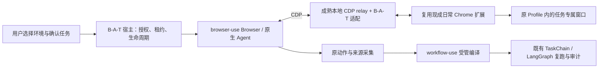

# 日常 Chrome 扩展接入与权限管理开发方案

## 2026-10-02 本轮失败复跑与授权验收更新

实际日常Chrome已保存授权可直接复用；本轮修改的是host就绪/释放确认与工作台入口，扩展worker未再改，无需再复制授权码、重新Allow或重载扩展。macOS Default（用户1）Profile现场：空闲131.5秒连接保持，原已发布GitHub V5完整完成，0模型，清理确认；服务与页面刷新后仍可连接。

用户操作：画布右上“再次运行”→“开始运行”。当前失败点击“查看失败原因”；新运行之后通过“更多操作”→“历史记录”→该次“查看失败原因”查看旧失败。复跑创建新记录，原原因/时间/版本独立保留；不要求用户操作手动清理按钮。原worker退出或用户再跑时只调用一次既有释放核验；没有真实关闭证明时不伪报确认。

旧03:33失败已由原未派发窗口创建的relay事实及AttachedWindow.verify_closed释放，原因可读为创建任务窗口阶段浏览器通信异常；具体断线触发原因未记录，不以本轮空闲反例推断为旧唯一根因。已发送而ACK丢失的反例仍拒绝空集合确认。复用入口、固定版本、许可证、所属验证与未测门见RESEARCH/PROGRESS最新节；Windows仍缺实机。

## 2026-10-02 当前实现与本地交付入口

本轮用户已确认重新加载扩展，现有用户1授权保留，没有新的人工授权步骤。环境弹窗已改成三项说明式选择，并把“已授权”和“连接状态”分别显示；已授权时主要操作是“连接 Chrome”，重新授权/撤销位于“授权管理”菜单。运行时仍自动连接；切换模式沿原保存合同，不增加链路复验。弹窗修改的通过/未测以及原 V5 的独立清理阻塞见 PROGRESS 最新节。

**首次批准自动保存授权已开发，工作台不再要求复制/粘贴码。** 原扩展 Allow 和 token、既有凭据存储/撤销队列继续复用。独立 owned Chromium 的一次批准、重启复用、两次零模型运行、隔离与撤销通过；实际日常Chrome154的原授权自动连接、刷新状态及最小普通运行通过。实际日常 Profile 的新首次批准及 Windows 尚未验收，真实任务的新失败单列在 PROGRESS。固定源码/依赖用于构建复现与许可证，不要求用户安装开发时的 Chrome 版本或降级。

原 GitHub V5 在窗口激活修复后曾完整通过，release/digest 不变，20 transitions / 23 browserCommands / 0 llmCalls、审计完整、清理确认。此次加载新版 API 后的另一次工作台运行在创建任务目标处失败，尚未派发业务节点；不得用原成功或最小样本改判。本轮具体事实与清理状态以 PROGRESS 最新节为准。

构建前从实际 checkout 根目录执行：

```sh
npm run upstream:setup
node scripts/build-daily-chrome-extension.mjs --prepare-tools
```

已有原固定工具时，最小构建只需 `node scripts/build-daily-chrome-extension.mjs`。构建器使用固定源码、上游原 Vite 配置，核验原 archive/文件摘要及固定 npm 包 integrity；不依赖 tests/VM helper，不安装或关闭 Chrome。产物是 `work/daily-chrome-extension/extension`，内含 manifest、MV3 service worker `lib/background.mjs`、原授权 UI、LICENSE、THIRD_PARTY_LICENSES.txt 和 UPSTREAM.json。manifest 中固定公共 key 保持 B-A-T 扩展身份，与微软原商店扩展身份区分；该 key 是公开标识，不是授权凭据。

macOS 与 Windows 的首次使用操作相同：

1. 在指定日常Chrome Profile的扩展管理页启用开发者模式，加载上述完整解压目录。此步骤由用户在Chrome完成；本会话用户此前已为 manifest 修补安装并确认重新加载，本轮又明确确认自动保存新版包已重新加载。现有真实授权仍可复用；后续原地更新时按同一扩展卡片重新加载，无需卸载、复制码或重选 Profile。
2. 工作台“浏览器环境”选择“日常 Chrome”和该 Profile，点“授权并连接”；在自动打开的扩展页点一次“允许并保存授权”。宿主收到原初始化及有效原 token 才保存；以后主动连接/运行自动打开或复用该 Profile，无需输入码。
3. 工作台分别显示“未授权/已授权”和实时连接状态，刷新后从持久记录恢复。已授权界面显示绑定名称，隐藏首次安装和码输入；未连接时点“连接 Chrome”，需要更新授权时从“授权管理”选择“重新授权”再批准一次。从该菜单选择“撤销授权”沿原队列立即断开并删除宿主凭据；等待首次批准可点“取消授权”，重新授权过程取消则明确标注“取消并撤销授权”。普通连接不暗中把取消操作变成删除凭据。若在原扩展授权页撤销并生成新码，仍通过工作台重新授权，不复制码。扩展 token 不跨 Profile 同步，B-A-T 不复制 Profile。
4. 更新时在原目录重新构建，停止当前任务并核验资源后，在同一Profile的扩展管理页“重新加载”；原key、协议和权限不变时保留原Profile-local token。身份/权限变化不能静默继承信任。本次补原connect.html对loopback的资源声明后，用户重新加载，Chrome154真握手/保存成功，未重新生成授权码；其他升级路径未测。
5. 禁用/卸载前停止并核验当前运行，再删除 B-A-T 保存的授权并在扩展页使旧码失效；随后使用 Chrome 原扩展管理操作。禁用/断开不自动恢复任务，沿既有失败/cleanup_required处理。卸载实机未测。

凭据消费公开 `@agent-platform/ai-connect/integration/credentials/provider-credential-store`，独立文件在当前数据目录的 `daily-chrome/auth.json`；由原库锁/原子写入/权限保护，不是加密存储承诺。状态 API 和链路/租约只含公开状态/endpoint，不返回 token。扩展源码来源与每项局部修改见 `vendor/daily-chrome-extension/UPSTREAM.json`。

连接页修补使用Chrome公开manifest合同：`web_accessible_resources`仅开放原`connect.html`给`http://127.0.0.1/*`；原token/协议检查不变。源码与证据见RESEARCH最新节。原HTTP跳转的Guid路径不含token，Chrome进程参数不含凭据。

实际验证入口：

```sh
node --import tsx --test apps/api/tests/browser-environment.test.ts apps/api/tests/daily-chrome-relay-compat.test.ts
BROWSER_USE_SETUP_LOGGING=false ANONYMIZED_TELEMETRY=false \
  work/upstream-browser-hybrid/.venv/bin/python apps/api/tests/fixtures/daily_chrome_relay_consumer.py \
  --browser-executable <用于独立验证的实际Chromium可执行文件>
```

在实际已绑定Profile做最小普通运行补证，先停止任务，通过既有环境切换释放闲置连接后恢复“日常Chrome”，再在实际checkout根目录运行：

```sh
BAT_SAVED_DAILY_PROOF=1 BROWSER_USE_SETUP_LOGGING=false ANONYMIZED_TELEMETRY=false \
  node --import tsx apps/api/tests/fixtures/daily-chrome-playwright-relay.ts
```

此模式仅读取现有保存授权，创建并回收合成页面的任务窗口，复用原W-U/LangGraph执行一次；不配对、撤销或改变产品发布记录。本轮 Chrome154 退出0、modelCalls=0、auditComplete=true、cleanup=confirmed。完整旧任务的新失败仍单列，不能由此改判通过。

Python consumer入口只创建新的合成测试Profile，使用真实最终扩展、原launcher/relay、持久凭据和B-U/W-U/LangGraph；无模型调用，不控制个人Profile。它在退出后回收自身进程/资料；撤销造成的产品控制清理未确认与fixture最终回收确认分别报告。测试Profile名称列表是合成元数据，不能替代真实Profile证据；上述显式BAT_SAVED_DAILY_PROOF入口才消费实际保存的日常绑定。

当前 **通过**：本轮授权/relay所属10项、API/工作台检查和最终扩展构建；独立真实 Chromium 一次批准自动配置、服务/浏览器重启复用、两次普通运行、个人页隔离及撤销/旧码拒绝；实际Chrome154原授权连接、刷新显示和一次最小原运行时样本。**失败**：本轮另一次原 V5 工作台运行在创建任务目标处失败，并进入 cleanup_required。**阻塞**：Windows实机。**未测**：实际日常 Profile 的无码首次批准、冷启动/重启、新包重新加载/卸载/扩展撤销、首次完整探索编译发布、额外iframe/popup/下载。原首败、夹具序列化失败与关闭 ACK/枚举竞争失败均保留，详见最新进度。

以下为已确认合同与历史阶段计划；本节覆盖其中旧状态，不改变产品取舍。


上一阶段状态（历史）：三环境配置/快照和专属模式已实现，当时日常扩展兼容与持久授权未完成。当前状态以上方交付节及 PROGRESS 最新节为准。

2026-10-01 继续实施：用户要求完成所有可开展开发，跨平台缺少实机不能扩大成整体停止。继续取得真实 relay 消费证据；三环境选择中，专属可见/无头直接沿用仓库已存在的 BrowserProfile、ManagedWindow 和清理合同，可独立补齐产品接线。日常扩展候选未通过兼容门前不冻结采用、不冒充已交付；已确认模式选择不产生链路复验。

```text
Product Alignment:
- natural-language task: 选择日常 Chrome、专属 Profile 可见或无头环境，下一次准备/运行使用该环境。
- reusable chain boundary: 原 TaskChain 与已发布版本不变，环境是执行输入快照。
- runtime inputs: 原任务输入与浏览器模式；运行期间不可改用另一个环境。
- dynamic task outputs: 原输出、运行和清理事实。
- generic platform capability used: 现有 BrowserProfile / ManagedWindow / TaskConnection 与执行记录。
- replay model calls: 普通节点 0，只有显式 llm 节点。
- site/task-specific code added: no

Reuse Assessment:
- capability: 三种既定浏览器环境的选择、持久化与既有执行入口适配。
- existing implementation in repository: owned_browser、ManagedWindow、AttachedWindow、BrowserProfileService、taskExecutionBrowserSchema、SQLite / Drizzle。
- mature candidates and pinned versions: 现有 browser-use 0.13.8、cdp-use 1.4.5、Radix Themes 3.3.0；不引入新库。
- selected implementation: 专属环境沿用现有实现；扩展候选仍待真实消费者验证，不在此冻结。
- reused public surface: BrowserProfile、Browser、既有 Python runner RPC、ProductStore / Drizzle、Radix Dialog / Select。
- B-A-T-owned adapter and remaining gap: 模式输入与运行快照、现有入口分流；不复制浏览器驱动、凭据或恢复实现。
- license/runtime/platform fit: 沿用仓库依赖与原许可证；macOS 实测，Windows 实机单列阻塞。
- browser/runtime/state ownership conflicts: 日常连接不得被专属模式隐式接管；只在空闲且旧连接清理已确认后变更选择。
- replay model calls: 0 新增调用。
- rejected candidates and evidence: 无库替换；候选扩展冲突见 P0 证据。
- focused validation: 所属模式分流/持久化/快照测试，以及两种专属环境实际启动、动作和清理。
```

后续已补证原版候选构建及独立测试 Chromium 的实际扩展 UI/后台加载，消费端仍为现有 browser-use/cdp-use，见 [P0 后续记录](DAILY_CHROME_EXTENSION_P0_EVIDENCE_20261001.md#后续补证用户不在电脑旁时的开发验证)。日常 Profile 首次安装/批准不应扩大为整个开发阻塞；这类无人值守开发验证可继续，但不能冒充目标 Profile、完整 relay 消费或 P0 兼容通过。

本轮开发 session 已获用户明确实施及必要最小验证授权，并执行 [P0 固定源码与反例](DAILY_CHROME_EXTENSION_P0_EVIDENCE_20261001.md)。三个候选目前均不能原样满足准入，已按约定交用户决定最小扩展/继续寻找；未冻结采用、未实施 P1–P4。下文“本 session 只授权只读/文档”描述原文档会话，不限制本轮已授权开发，也不授予新增取舍或受保护安装确认。

## 1. 目标与授权范围

在用户实际日常使用的 Chrome/Profile 中完成浏览器任务，保留该环境已有登录态、站点存储和扩展；使用可查看、可撤销的持久配对，减少每次连接时的原生 Allow 确认。首次探索、记录、编译、验证和正式复跑继续使用现有 browser-use/workflow-use 路径。

用户需要保留三种可选环境：日常 Chrome、专属 Profile 的可见浏览器、专属 Profile 的无头浏览器。日常 Chrome 的适用价值包括用户已经实际成功使用的京东等站点任务；实际站点效果必须由同条件样本核验，不把慢速或扩展接入等同于不会触发访问限制。

本 session 只授权只读核查、需求访谈和文档编写。产品实施在新的 session 中开展；本文不是安装、启停服务、连接用户浏览器、提交、推送、创建分支/worktree或派发实施的授权。

### 实施原则：现成开源实现优先（用户强制）

用户最新要求：“不要做任何决策，你能抄就抄，不要自己自作聪明”。它适用于开发中的每个环节，不只是浏览器 relay 的选型：安装/构建、Chrome 启动、扩展通信、授权与凭据、连接生命周期、任务页面管理、权限 UI、错误处理和平台支持都先查现成实现。

- 已确认的产品选择照做；没有确认的新增产品、架构或选型取舍不由开发 agent 自行冻结。调查源码、运行验证与如实记录结果仍由开发方完成，不把这些调查转成用户问卷。
- 优先通过公开 API、原项目流程或可追踪的受管源码直接复用。可沿用的现成逻辑按其许可证、固定版本和原有行为沿用；不以“更安全”“更可控”“以后扩展”为理由重设计等价能力。
- B-A-T 只保留既有产品职责和必要的薄适配：任务授权/所有权、现有 IR 绑定、审计、运行与清理事实。新增之前先找仓库已有 seam；不另造授权协议、凭据系统、通用状态机、浏览器驱动、Agent loop、选择器或执行器。
- 下文的字段、接口和文件落点表示所需语义与调查范围，不要求新建同名实现。尤其不冻结自定义短期 token、epoch/generation 协议或 OS 凭据包；优先使用成熟组件已提供的身份、撤销、存储和连接机制。
- 若现成实现不能满足已确认的不变量，先记录固定源码、最小真实反例和可沿用的方案。需要改变范围或增加自有机制时，拿具体冲突交给用户决定，不能默改要求、另写一套或把未验证建议当作决定。

### Product Alignment

```text
Product Alignment:
- natural-language task: 用户选择浏览器环境，在自己的日常 Chrome 中执行已确认任务，并管理持续连接授权与撤销。
- reusable chain boundary: 原参数化 TaskChain；连接通道和授权记录不成为新的可执行图。
- runtime inputs: 已确认任务与运行输入、浏览器环境引用、有效配对引用、任务控制租约。
- dynamic task outputs: 保留既有任务输出、运行事实和清理事实；本功能只新增通用连接/授权状态。
- generic platform capability used: 浏览器连接、任务页面所有权、授权核验、运行生命周期、人工等待和审计。
- replay model calls: 普通节点 0；显式 LLM 节点遵循既有合同。
- site/task-specific code added: no
```

## 2. 当前证据基线

本次实际 checkout 的只读快照：分支 `master`，HEAD `674ed366222961840a7e0af8495f37ad81b8ae1d`，访谈开始时工作区干净。这些是观察基线，不能成为后续 reset 或强制回到该提交的指令。

| 已核查内容 | 事实与边界 |
| --- | --- |
| 当前浏览器组件 | browser-use `0.13.8`、cdp-use `1.4.5`、workflow-use `0.2.11`；版本约束见 `scripts/setup-upstream-browser-runner.mjs`。 |
| workflow-use 来源 | 受管 fork 基线 `5d2d19fe8835cc86f1bf3e04302a5000d590f249`，见 `vendor/workflow-use/UPSTREAM.json`。 |
| 日常 Chrome 原生入口 | `daily-chrome-connection.ts` 读取 Chrome 的 `DevToolsActivePort`，连接已有实例，不复制 Profile。 |
| 父连接复用 | `TaskConnection` 和 `ConnectedTaskScope` 保留同任务父连接；独立 operation 使用各自的页面租约。 |
| Python 页面边界 | `AttachedWindow`、`TargetScope` 限定任务拥有的目标；当前 URL 校验只接受 loopback 的原生 `/devtools/browser/` 路径。 |
| 现有断线策略 | `TargetScope.ensure_connection` 和受管 `_auto_reconnect` 禁止 SDK 擅自重连；`TaskChainRuntime.executeExclusive` 对普通异常进入 `failRun`。已有检查点恢复不等于断线后自动暂停/续跑。 |
| 已记录实机事实 | PROGRESS 的 2026-09-30 记录有同任务第二次 operation 无 SDK connect/无重复 Allow，20 transitions、23 browserCommands、0 llmCalls 的成功运行。 |
| 尚未证明 | 跨任务/Chrome 重启/服务重启的持久授权、扩展 relay 与完整 B-U/W-U 链路兼容、该路径下的京东样本、Windows 安装与生命周期。 |

PROGRESS 顶部的 2026-10-01 修复记录与当前 Git HEAD 不是同一个提交快照；文档中的历史“未提交”措辞不能覆盖上述实际 Git 观察。新 session 必须重新核对工作区，禁止继承历史启停或提交授权。

最高设计依据仍是 [TASK_CHAIN_ARCHITECTURE](TASK_CHAIN_ARCHITECTURE.md)，特别是 browser-use 所有权、普通节点零模型、人工等待和运行/清理结论分离。

## 3. 已确认决策与实施责任

| ID | 事项 | 状态 | 决策/建议 |
| --- | --- | --- | --- |
| D1 | 默认控制哪些页面 | 用户已确认 | 仅任务专属窗口；使用原 Profile。个人标签页不自动进入控制范围。 |
| D2 | 首版交付平台 | 用户已确认 | macOS 和 Windows；可以先在 Mac 开发，但两平台分别完成安装、配对、重启和撤销实机验收才能完成首版交付。 |
| D3 | 已发布链路切换浏览器环境 | 按用户指正修正 | 模式切换不改变链路，不新增强制复验。下一次运行使用所选模式，连接/授权/节点合同沿用正常运行检查。 |
| D4 | 运行中控制连接断开 | 继承既有失败与恢复合同 | 停止派发并保留实际事实；普通连接异常按现有错误路径失败。只消费已经成立的检查点/人工等待恢复能力，不新增自动续跑机制。用户追问含义，不记为选择了自动或手动恢复。 |
| D5 | 任务结束的窗口保留 | 继承既有契约 | 清理和现场交付分别记录；只有任务明确需要现场交付时保留其页面。 |
| D6 | 扩展安装/分发 | 用户已确认 | 开发阶段先本地加载解压扩展；本期交付包含两平台本地安装与更新说明，Chrome 商店发布不在本期范围。 |
| D7 | 来源授权与连接授权 | 继承既有契约 | 配对不扩大任务来源和业务动作授权；已确认需求/计划仍约束运行。 |
| D8 | 桥接组件选型 | 待真实验证 | 已核查 Playwriter 公开 CDP relay 与 Playwright 官方扩展；它们是候选证据，不是采用决定。复用现成能力，不自行设计第三套方案。 |
| D9 | 日常 Chrome 未打开时 | 用户已确认 | 用户发起连接/运行时自动打开已配对的日常 Chrome/Profile；已有实例直接复用，不重启。 |
| D10 | 首版日常 Profile 数量 | 用户已确认 | 一个指定 Profile；禁止静默跟随最近 Profile。更换绑定须明确重新配对，不建设多 Profile 选择功能。 |

本次产品取舍已收敛，不再追加问卷。协议兼容、凭据组件和启动方式由开发方按 P0 查现成源码并取得证据；新增选型或范围取舍不能由 agent 自行冻结。

## 4. 责任边界与接入结构



- browser-use 继续拥有原生 Agent、Browser、观察和页面动作能力；workflow-use 受管 fork 继续负责既有编译能力。
- 成熟 relay 承担 CDP 传输、session/target 映射和协议兼容。B-A-T 增加项目所需的授权核验、任务资源所有权和产品生命周期适配。
- 扩展在真实日常 Profile 中建立任务窗口；先确认资源所有权，再向消费者暴露目标和事件。
- 持久配对、物理连接、任务父连接、operation 页面租约和 TaskRun 是不同事实，不能互相代替。
- TaskChainRuntime/LangGraph 职责保持原边界；不引入新的 Agent loop、DOM/selector 引擎、工作流执行器或调度器。

## 5. 任务窗口所有权（D1 已确认）

1. 默认通过扩展在绑定 Profile 中创建新的普通任务窗口，保存真实 window/tab/target 对应关系与 owner。
2. 只有经本任务创建并登记的页面及可证明由已拥有页面打开的任务 popup 能取得控制权；窗口号相同本身不构成页面授权。
3. 手动把个人标签页拖进任务窗口、重用 windowId/tabId、多个 Profile 同时连接，均不得自动扩大授权。
4. 目标列表、标题/URL、DOM、dialog、截图和事件都必须先过滤所有权，再传给 Browser/Agent。仅在模型 prompt 中声明“不要操作个人标签页”不满足边界。
5. 错误时不得把焦点恢复到用户其它标签页，不得以重新启动 Chrome、复制 Profile 或创建私有浏览器补救。
6. close/release/revoke 只处理本次证明拥有的连接和任务页面，不能调用关闭整浏览器、杀用户 Chrome 或清除 Profile 的操作。
7. 已完成 TaskRun 和业务输出不因清理失败被覆盖；无法确认释放时沿用 `cleanup_required`。

## 6. 复用核查与必须先完成的兼容门

### Reuse Assessment（候选阶段）

```text
Reuse Assessment:
- capability: 日常 Chrome 内通过扩展建立可撤销的持久信任，并向现有 browser-use 提供受限 CDP 连接。
- existing implementation in repository: 原生 dailyChromeConnection + TaskConnection + AttachedWindow + TargetScope；没有扩展持久配对。
- mature candidates and pinned versions: Playwriter main 33d5c5a2c5ebf702e387d94d609e038c98e0acec（package 0.7.0 / extension 0.0.151）；Playwright main 8b552173e8d767db29b8baef8f4a1f08cf7f26bf。
- selected implementation: 尚未冻结；Playwriter 公开 CDP relay 与 Playwright 官方扩展均为已核查候选，验证其真实适用范围后记录采用依据，不自行另设方案。
- reused public surface: 已找到 Playwriter src/index.ts 的 startPlayWriterCDPRelayServer；仍需核验它能否直接复用。消费者保持 browser-use Browser(cdp_url)。
- B-A-T-owned adapter and remaining gap: 优先复用候选现成身份/授权/生命周期，使用既有 B-A-T 目标所有权、TaskConnection、取消、清理和审计 seam；完整协议兼容仍待验证，不预建另一套配对与租约系统。
- license/runtime/platform fit: Playwriter 根 LICENSE 为 MIT，package license 字段为空；TypeScript/Node，Windows 真实支持待验。Playwright relay 源码为 Apache-2.0；内部模块不是稳定公开接入 API。
- browser/runtime/state ownership conflicts: relay 的多客户端/默认 Profile 选择、全局目标暴露、页面创建和辅助执行器生命周期必须逐项排除冲突。
- replay model calls: 传输与权限管理 0；不接入额外 Agent/模型。
- rejected candidates and evidence: 未经验证不宣称永久淘汰；BrowserSkill 的整套工具协议不作为当前 B-U/W-U 驱动的替换或混合实现。
- focused validation: 浏览器级和 target/session 命令、任务窗口隔离、普通动作/读取/iframe/popup、完整原生探索→编译→零模型复跑、撤销和重启行为。
```

已经查到的具体差异：

- 当前 `AttachedWindow._endpoint` 只接受原生 browser WebSocket 路径，relay 的 `/cdp` 不能直接通过；还拒绝 query，不能简单把长期 token 塞进 URL。
- Playwriter 的 `Target.createTarget` 转成 `createTabInPreferredWindow`，没有消费我们的 `newWindow` 需求；需要明确的成熟扩展窗口映射，不能谎报创建了独立窗口。
- Playwriter `Target.getTargets` 来自 extension 的 connectedTargets；B-A-T 的隔离要求不能仅依赖客户端过滤或 tab group 名称。
- Playwright relay 对 browser 级接口有所模拟，`newWindow` 也不属于原实现的创建参数；不能从“有 CDP endpoint”推断与 cdp-use/Browser-Use 完整兼容。
- Playwriter 默认 `createCdpLogger` 会建立并写入 CDP 日志；截断字符串并不能满足敏感信息边界。必须使用其 logger 注入点关闭原始协议记录，并实测异常/启动日志也不泄漏。
- Playwriter 的 `ensureRelayServer`/`killRelayServer` 会依据端口和版本查找并结束进程。B-A-T 不得调用这种无本次资源所有权证明的自动管理行为。
- `startPlayWriterCDPRelayServer` 本身还注册 CLI 执行器、录制、远程/云会话功能，启动后调用 orphan-cloud 清理。仅不调用 CLI 不是排除副作用；必须核验是否能通过公开配置或受管的最小上游扩展关闭这些功能及其历史状态读取。
- browser-use 固定版本已有 `BrowserProfile.headers`，连接时传递为 CDP WebSocket 的 `additional_headers`。这是复用成熟凭据入口的候选消费能力，不是要求新增短期 token 方案；授权格式和通道按成熟组件核验，辅助 `_client` 也须消费同一有效授权，秘密不得写入普通租约/日志。

新 session 的第一阶段必须消费真正固定版本的候选代码，记录完整授权、协议、隐私与生命周期反例，并逐项注明采用的现成入口。若公开 API 不足，先查上游其它入口和成熟方案；需要自有新机制或大规模补写时停止该部分实施，带源码证据提出具体取舍，不能自行另写通用 CDP 驱动。

| 开发环节 | 必须先查找/沿用的实现 | B-A-T 最小职责 |
| --- | --- | --- |
| 扩展构建、本地安装与更新 | 所选上游 extension 的原构建、manifest、加载与更新流程 | 本项目交付入口及安装说明，不新建安装器。 |
| Chrome/Profile 自动打开 | 已有依赖或成熟浏览器启动组件的正常 Chrome/Profile 入口 | 消费用户已绑定环境并验证实际握手，不新写平台发现/启动框架。 |
| 扩展通信、CDP 与 session 映射 | 成熟 relay/extension 原传输与协议映射 | 将既有 owner/任务范围接入其公开扩展点。 |
| 首次批准、持久授权、撤销与凭据 | 成熟 extension 的授权流程及其受支持的存储/身份机制 | 映射公开授权状态和任务准入，不自造密码学/配对协议。 |
| 页面/窗口、断连和清理 | 成熟控制组件与仓库 TaskConnection/TargetScope 的既有能力 | 保证本次资源所有权、结果与清理分别记账。 |
| Agent、记录、编译、执行与恢复 | browser-use、workflow-use、既有 TaskChainRuntime/LangGraph | 使用现有 seam，补项目特有绑定和审计。 |
| 权限 UI 与即时反馈 | 当前 Radix/产品组件及上游扩展现成连接 UI | 组合已确认产品流程，不复制组件框架。 |
| 平台与错误路径验证 | 上游原测试/样本与所属现有测试 | 只补真实 B-A-T 边界反例，保留首次结果。 |

## 7. 来源与证据索引

- [Chrome 原生连接要求](https://developer.chrome.com/blog/chrome-devtools-mcp-debug-your-browser-session)：每个新远程调试会话需要确认；同连接复用不能证明跨重启持久授权。
- [Chrome debugger API](https://developer.chrome.com/docs/extensions/reference/api/debugger)：扩展调试权限、可用 CDP domain、flat session 与企业策略限制。安装权限较宽；任务/来源限制属于产品政策，不能声称是 Chrome 提供的站点沙箱。
- [Playwright 扩展固定源码说明](https://github.com/microsoft/playwright/blob/8b552173e8d767db29b8baef8f4a1f08cf7f26bf/packages/extension/README.md)：按 Profile 的 token、免重复确认、可查看/断开连接。
- [Playwright CDP relay](https://github.com/microsoft/playwright/blob/8b552173e8d767db29b8baef8f4a1f08cf7f26bf/packages/playwright-core/src/tools/mcp/cdpRelay.ts) 与 [BrowserModel](https://github.com/microsoft/playwright/blob/8b552173e8d767db29b8baef8f4a1f08cf7f26bf/packages/playwright-core/src/tools/mcp/browserModel.ts)：协议适配参考，不是已确认公开组件。
- [Playwriter public export](https://github.com/remorses/playwriter/blob/33d5c5a2c5ebf702e387d94d609e038c98e0acec/playwriter/src/index.ts)、[CDP relay](https://github.com/remorses/playwriter/blob/33d5c5a2c5ebf702e387d94d609e038c98e0acec/playwriter/src/cdp-relay.ts)、[extension](https://github.com/remorses/playwriter/blob/33d5c5a2c5ebf702e387d94d609e038c98e0acec/extension/src/background.ts)：已做静态源码核查，未在 B-A-T 中实际连接。

## 8. 安装、配对与权限产品流程

以下是待具体组件验证的设计合同；实现不得通过默认 token、固定端口或页面标题猜测用户授权。

### 8.0 本地开发安装与更新（D6 已确认）

1. 首版提供固定源码版本构建的解压扩展目录；交付内容包括构建入口、目录位置、版本/权限清单、安装、更新、禁用、卸载和配对撤销说明。准确命令在 P0 选型后按成熟组件实际构建入口填写，本文不虚构可运行命令。
2. macOS 与 Windows 均在用户指定的日常 Profile 中打开 `chrome://extensions`，启用开发者模式并“加载已解压的扩展程序”。首次安装权限和配对确认由用户完成；B-A-T 不代点浏览器受保护授权。
3. 选型时验证解压扩展 ID 的稳定方式以及扩展内独立的 Profile/安装身份。不能只凭扩展 ID 认领 Profile，也不能因本地目录或构建机器改变就静默绑定另一份授权。构建产物不得包含用户 Profile、配对秘密或页面数据。
4. 更新先保留原安装与有效配对；只有身份一致、协议/授权版本兼容且权限没有扩大时才能沿用。身份变化、权限扩大或不兼容时显示实际原因，再按需要安装确认/重新配对；不能清空凭据伪装更新成功。
5. 本期验收本地安装、更新、重启和撤销。Chrome 商店审核、签发、商店自动更新不作为当前开发阶段的交付门。

### 8.1 初次连接

1. 用户在准备任务前选择日常 Chrome。工作台显示“未安装扩展 / 未配对 / 浏览器未打开 / 可连接”等明确状态和下一步。
2. 用户在实际需要使用的 Profile 中安装扩展并完成 Chrome 权限确认。安装授权和 B-A-T 配对是两件事；不自动点击受保护确认，不关闭调试提示，不要求修改安全启动参数。
3. 沿用所选成熟扩展的首次批准/配对流程，明确本机 B-A-T 身份、指定 Profile 和“仅任务窗口”的范围。用户明确同意后才能持久保存信任；不要求开发方自建一次性配对协议。
4. 优先沿用成熟组件已有凭据存储和身份机制；宿主只保存所需非秘密引用及公开授权状态，扩展授权限定该 Profile，不使用跨机器同步存储传播控制权限。具体存储入口须有源码/实机证据，不预先指定新包或另建凭据系统。
5. 配对成功只显示“已授权，可连接”；收到有效握手和能力核验后才显示连接 ready。安装成功不等于连接成功，连接成功不等于某任务已经完成。
6. 首个任务必须能从无已附加页面的状态创建专属窗口。不得先调试个人标签页取得初始化条件，也不得选“最近一个 Profile”作为静默后备。

### 8.2 后续运行

用户在既有链路工作台点击运行；宿主按当前任务版本、输入、来源和环境建立 operation 租约并连接已配对的唯一 Profile。有效配对期间目标是免重复连接批准；Chrome 本身的调试提示和取消入口仍可能出现，不承诺消除浏览器安全 UI。

D9 的自动打开只由用户主动连接/运行触发：

1. 已有 Chrome 实例时复用它；目标 Profile 尚无窗口时，通过 Chrome 的正常启动/打开能力打开该既有 Profile，不能重启已有浏览器。
2. Chrome 未运行时，复用成熟平台启动能力打开已绑定的真实 Profile。启动定位信息来自实际配对/用户选择，不能按默认目录或最近 Profile 猜测；不复制 Profile，不添加远程调试参数，不启动替代私有浏览器。
3. 打开成功后等待有界的扩展握手，核验本机/扩展安装/Profile 身份、授权版本和协议能力；只有匹配后才创建任务窗口与租约，启动进程本身不算连接 ready。
4. 找不到 Chrome、启动失败、扩展禁用、错误 Profile 或握手超时，返回明确原因和下一步；不回退到另一环境。工作台在同一渲染周期显示已接受/正在打开/错误反馈。
5. 运行中控制连接断开不触发自动重启 Chrome 或重新派发任务。用户下一次主动运行仍可消费有效配对，沿用既有独立运行语义；恢复同次运行须满足 §11.1 的既有合同。

macOS/Windows 的准确启动参数和退出所有权必须在 P0 按实际 Chrome 与成熟启动组件核验。由 B-A-T 打开的日常 Chrome 仍属于用户；停止任务或退出 B-A-T 不因此取得关闭它的权限。

任务进入人工等待时在本任务现场交给用户，交还后走既有页面观察和恢复核验。连接授权不代替任务计划授权，不授权处理验证码、绕过限制、支付或新增来源。

### 8.3 权限管理界面

工作台与扩展均能查看所选 Profile、授权状态、当前任务和控制状态。至少提供以下语义明确的操作：

| 操作 | 效果 | 后续连接 |
| --- | --- | --- |
| 既有人工等待/接管 | 沿原人工等待合同停派动作并交付任务现场，不新增通用暂停/续跑状态机。 | 连接是否保留遵循现有能力；交还必须核验现场。 |
| 停止当前任务 | 取消本次运行；清理或保留已授权交付页，保存取消和清理事实。 | 不自动恢复同次任务；以后用户主动运行可消费有效配对。 |
| 断开连接 | 撤销当前物理连接与活动租约；持久配对保留。 | 不立即自动接回；以后用户主动连接/运行才能建新连接。 |
| 撤销授权 | 沿用成熟撤销入口，立即拒绝后续命令、使当前租约和凭据失效，再执行尽力 detach；版本/轮换细节采用其原实现。 | 必须重新显式配对。 |

扩展被禁用、卸载、Profile 更换或用户取消调试，与显式撤销/断开分别记录；任何用户主动收回控制都禁止自动重新附加。普通 Chrome/服务进程重启后，下一次用户主动连接不应要求重做有效配对，仍要重新建立和核验物理连接。这不意味着重启前失败的任务自动继续。

### 8.4 窗口可见性与现场交付

默认新建任务窗口有清晰的任务标识，后台 CDP 动作不能被替换成操作系统全局键鼠。用户在其它窗口日常浏览时，本任务不得读取其页面、改变其导航或抢占全局输入。

成功、失败、取消后的页处理沿用现有任务现场交付合同。需要交付原页面时，应先停止自动控制、关闭调试连接并完成可证明的所有权转交；以后恢复需新租约。普通清理只关闭任务拥有的页面，不能因窗口曾为任务创建就关闭用户后来放入的私人页面。

## 9. 配对凭据、连接身份与本地边界

### 9.1 最少事实

以下概念映射到现有产品事实和所选成熟组件原有机制，不要求各建一套数据库或状态机；字段名为语义示例，采用原接口能满足要求时不再增加一份：

| 概念 | 非秘密内容 | 唯一职责/事实源 |
| --- | --- | --- |
| 浏览器环境引用 | 类型、显示方式、opaque Profile 引用、选择修订 | 宿主记录用户实际选择；单次运行保存快照。 |
| 持久配对 | 非秘密配对/身份引用、Profile 身份、有效/已撤销状态 | 成熟组件拥有真实授权/凭据；宿主只消费并投影必要状态，不得用旧 cached paired 绕过撤销。 |
| 物理连接 | 连接身份、协议能力和连接状态 | 成熟 relay 拥有真实连接及其代次机制；B-A-T 保存可审计投影。 |
| 任务父连接 | task owner、环境指纹、当前占用 | 复用现有 TaskConnection/ConnectedTaskScope，不把空闲父连接记作已退出。 |
| operation 租约 | 既有 operation owner、task/execution/plan 引用、目标集合、状态与有效连接绑定 | 宿主沿用本次资源事实；通过成熟作用域接口接入，不新建通用租约系统。 |

连接配置不能把真实 Chrome Profile 文件路径当作本次运行工作目录。当前 Python `profilePath` 承载的是 B-A-T 租约与辅助状态目录；新契约应保留这一用途并澄清名称，禁止改成用户日常 Profile 路径。

### 9.2 凭据生命周期

- 凭据生命周期和存储先沿用所选成熟组件。仓储只存必要非秘密引用，不将秘密放入运行预设、任务输入、模型上下文、页面脚本、日志、argv、Git 或测试快照。
- 首版只绑定一个指定 Profile。配对限定本机安装身份与具体 Profile；其它 Profile 即使安装了相同扩展也不能只凭扩展 ID、窗口标题或邮箱认领。身份不一致立即阻断；用户更换绑定时须明确撤销原绑定并重新配对，不迁移秘密或继承页面租约。
- 优先消费成熟组件原有 token/连接身份/撤销能力，并与既有 operation owner 的资源边界适配。长期信任不等于所有连接都可控制所有目标，但这不要求自设计短期 token 或 epoch 协议。
- browser-use 已有 header 接入是可核验的消费入口；凭据的格式、有效期和握手以所选成熟组件为准。extension→relay 的握手、批准和撤销直接沿用已有机制，不自造密码学或一次性配对协议。
- API/UI 返回的连接状态及复制诊断不含秘密；对错误对象、URL、headers、异常嵌套链、默认第三方 debug 输出也要核验。
- 撤销先在命令准入层生效再清理。不能把 detach/进程清理成功作为权限失效的前置条件。已经派发的浏览器动作无法承诺撤回，记录可能已发生的副作用。
- 受支持的凭据读取/存储不可用时进入明确未就绪状态，不记录为 paired ready，不另写临时凭据存储绕过成熟组件的失败。

只有现成组件确实缺少所需存储能力时，才拿具体缺口核查成熟补充方案；不预设必须新增 Keychain/Credential Manager 包。采用依据、许可证、平台限制与失败行为记录在同一 Reuse Assessment，不为文档中的建议再造一套基础设施。

### 9.3 本地服务与多实例

- 控制服务仅监听 loopback，验证 Host、Origin、客户端身份和授权版本；localhost 本身不等于已授权。普通网页不能通过访问本地服务请求控制浏览器。
- 每个实际控制会话只借给一个产品运行；竞争者收到 typed busy，不能终止占用者或共享焦点。新功能不顺带建设浏览器并发调度器。
- 桥接实例启动后记录本次资源所有权。端口占用必须报冲突或通过成熟发现机制验证并使用明确同属实例；禁止按端口结束进程。
- B-A-T 退出只释放自己拥有的 runner/relay/调试附加，不结束用户 Chrome，不处理其它 Playwriter/其它 B-A-T 实例的历史资源。
- 重启后的旧 target/session ID 不可当作活授权；Profile 相同也须通过成熟组件核验本次实际连接与目标/文档身份，不要求另造 generation 协议。

## 10. 来源范围与操作权限

继续消费已确认需求/计划的 `allowedOrigins`/`allowedSites` 和现有 `origin-access-gate`；任务来源是允许在哪里工作，配对是允许哪台 B-A-T 连接，窗口租约是允许控制哪些页面。

默认不新增让用户手填 selector、origin JSON 或全局站点配置的表单。来源扩大、登录授权或访问限制沿用业务确认/人工等待，不让 extension 以静默接受重定向的方式扩大控制权限。

窗口和站点准入属于可信 B-A-T 与扩展执行的产品边界。Chrome `debugger` 权限较宽，页面可发送正常站点网络请求；不能把这套机制宣传为对恶意扩展/被攻陷本机/任意页面脚本的强隔离沙箱，也不能把“仅采集任务”解释为 CDP 技术上只有读权限。

准入必须核验 method、session→target→lease 和当前有效授权：禁止关闭整个浏览器、清空存储、创建无归属窗口、修改用户全局 Profile 设置或读取未授权目标。优先接入成熟组件原有权限/目标作用域与现有 TargetScope；错误明确返回，不将不支持的接口无条件 `{}` 成功。对确实可安全无操作的 SDK 配置要有固定源码与行为证据。

## 11. 协议能力矩阵与失败合同

先验证现有注册动作范围，不把 browser-use 全部能力作为本期默认新增范围。

| 能力 | 准入/兼容要求 | 本期证据 |
| --- | --- | --- |
| Browser.getVersion / 连接握手 | 正常识别协议；relay 模拟返回不能充当真实浏览器环境证明。 | 已核查候选源码；真实消费未测。 |
| Target.getTargets / getTargetInfo | 仅本租约目标；不得向 Agent 泄漏个人页面元数据。 | 当前宿主有过滤；relay 侧待验。 |
| createTarget(newWindow) | 原 Profile 独立任务窗口；空目标冷启动可用。 | 候选原创建路径有差异，待补齐/验证。 |
| attach / detach / autoAttach | 保持 flattened session 身份和事件路由；拒绝其它租约。 | 候选支持部分方法；cdp-use 完整消费待验。 |
| Runtime / DOM / DOMSnapshot / Accessibility | 复用原 SDK 观察和记录，输入与返回只属于拥有的目标。 | 未测。 |
| Input / Page | 原生动作/键鼠/滚动/导航/对话框仍走原 SDK 与注册工具。 | 未测；不替换为操作系统全局键鼠。 |
| popup / frame | 只按真实父目标关系扩展 owner；窗口搬移不得丢 session。 | 现有 PopupResume/TargetScope 接口复用，候选待验。 |
| OOPIF | 若当前动作合同需要，验证实际子 session；现有 cross_origin_iframes=false 不能冒充一般支持。 | 按真实所需范围验收，不顺带重写 DOM 引擎。 |
| 下载/上传/文件 | 只声明已实际可用的任务能力；不得修改 Profile 全局下载设置或借全浏览器权限绕过缺口。 | 本期是否需该业务范围按既有任务能力决定。 |
| close / release / revoke | detach 与目标关闭分别核验；已完成结果和清理状态分离。 | 未测。 |

复用组件不能只返回“连接成功”。能力不足必须在准备/运行准入时形成明确 unavailable/unsupported 原因；不在普通运行失败后调用模型或临时切浏览器。

| 场景 | 产品结果与后续动作 |
| --- | --- |
| 未安装/未配对/凭据不可读 | 未就绪，解释下一步；不启动替代浏览器。 |
| Profile、授权版本或 owner 不符 | 拒绝控制，保留非秘密原因，不迁移到另一 Profile。 |
| 端口/会话被其它实例占用 | busy/冲突；不杀进程、不抢占其它任务。 |
| Chrome 未打开 | 用户发起连接/运行时自动打开已绑定 Profile，并核验握手；启动失败明确返回，不切环境。 |
| Chrome/服务重启 | 下一次用户主动连接可消费有效配对；旧连接和租约不能直接继续，任务不自动续跑。 |
| 运行中控制连接断开 | 停止派发，保留实际成功/失败/不确定动作事实；普通连接异常按现有失败路径处理，恢复条件见下节。 |
| 用户取消调试/关闭任务页 | 收回本次控制；禁止自动附加或补建页面继续任务。 |
| revoke 与命令竞态 | 撤销立即阻断未派发命令；沿用成熟组件的失效/轮换机制，已派发未确认动作记不确定，不重复提交。 |
| SDK/relay 支持不足 | 明确 compatibility gap；不得以模拟成功或换引擎覆盖。 |
| 清理 ACK/资源存在性不足 | 保留 TaskRun/输出，execution cleanup_required；仅恢复本次资源。 |

### 11.1 “掉线”与“继续”的准确含义

这里的掉线指 B-A-T 控制链路 `browser-use ↔ 本地 relay ↔ 扩展 ↔ Chrome 调试目标` 断开。例如 Chrome 崩溃/退出、本地 relay 或 Python runner 异常退出、系统休眠造成已有通道失效。是否实际断开以连接关闭、detach 或既有有界调用失败事实为准；不为此新增高频健康轮询。

站点加载超时、登录过期、验证码和访问限制分别沿用现有页面/人工等待合同，不统称为控制掉线。用户主动关闭任务页、停止、取消调试或撤销属于主动收回控制，禁止以自动重连覆盖该决定。

此前所说的“继续”是同一次运行利用已有检查点和恢复核验继续合法控制流，不是浏览器重开后自动重做动作。当前代码证据为：

- `apps/api/python/browser_use_runner/target_scope.py` 的 `ensure_connection` 与受管 `_auto_reconnect` 会拒绝未经许可的 SDK 重连。
- `packages/runtime/src/task-chain/runtime.ts` 的 `executeExclusive` 在中断/预算分支以外将异常交给 `failRun`，因此普通连接异常不会自动生成一个暂停且可继续的运行。
- `packages/runtime/src/task-chain/types.ts` 已有 `RuntimeControl.checkpoint/resumeRequest` 与 `TaskChainCapabilities.verifyResume`；只有原合同允许、实际检查点存在且浏览器/文档/owner/副作用核验成立时才能消费，不等同于所有失败都可恢复。

本期继承这套失败与恢复合同，不新增自动重连续跑、通用“继续”按钮或让模型重新找路的修复环。恢复控制连接和恢复 TaskRun 是两件事；ACK 丢失时不得盲目重派，失败记录不能被下一次成功覆盖。

## 12. 浏览器环境选择与版本兼容

产品显示三种选择：日常 Chrome、专属 Profile（可见）、专属 Profile（无头）。内部应把用户资料身份与显示方式分开，日常 Chrome 不接受 headless=true；其它 Profile 的凭据不能复用于日常 Chrome 配对。

每次准备和运行保存实际环境快照，失败界面显示该实际选择。环境未就绪不能静默换另一环境。日常 Chrome 的 extension 与原生 CDP 是连接通道，不能把二者包装成同等“免授权”；原生入口若保留必须明确选择和其真实授权限制。

D3 按用户指正修正：模式切换不是链路变更，不额外插入“先复跑验证一次”的产品阶段。新选择在下一次运行生效；活动运行不原地迁移到另一个浏览器，原 TaskChain/source/release 及历史运行保持不变，不新增模型调用。

运行前仅核验正常运行所需的连接、授权和可用能力，运行中按原节点条件和效果合同执行。缺登录走现有人工等待，能力或页面不匹配按实际合同失败，不能用额外复验/重新探索掩盖。开发验收仍需测试三个模式的真实选择行为；这是开发验证，不是强加给产品用户的运行步骤。

当前 RunnerProcess.startHybrid 统一调用 dailyChromeConnection；已有 BrowserProfileDialog/profile_start 不证明三种模式完整接线。新 session 需先核对现存 dedicated/owned browser 入口和所有权，再做最小连接选择适配；不恢复 BrowserSkill 驱动，不绕过同运行唯一控制会话。

## 13. 契约与文件落点

接口名称是语义示例，不冻结一套新 API；先用仓库现有领域契约和成熟组件公开接口。所有跨包/跨进程/extension 适配消息必须使用版本化 typed schema，并在边界立即校验。

### 13.1 产品接口建议

| 接口语义 | 最少输入 | 最少返回 |
| --- | --- | --- |
| 浏览器连接状态 | 当前环境引用 | 安装/配对/连接状态、公开能力、活动任务和 typed reason。 |
| 发起配对 | 指定 Profile、本机安装身份及成熟组件所需输入 | 成熟批准流程的公开状态/非秘密引用；不附加自定义一次性协议。 |
| 完成配对 | 成熟流程的真实确认及完整绑定 | 真实配对/身份引用、公开状态；沿用其版本字段。 |
| 撤销配对 | 既有配对/授权引用及成熟撤销入口所需输入 | 权限已失效事实和独立清理结果。 |
| 选择任务环境 | taskId、选择修订、环境引用 | 已保存选择；下一次运行生效，不附加链路复验步骤。 |
| 请求运行连接 | 既有 task/plan/execution/owner、有效配对引用 | 既有租约与成熟连接身份；凭据只进入必要的控制组件。 |
| 停止/断开 | 既有 operation/connection 引用 | 用户收回控制事实、原运行与清理记录。 |

尽量使用已有 task/workspace 投影和变更通知，不增加健康状态的高频轮询；扩展显示 actual state 而非自己猜测 TaskRun 完成。

### 13.2 现有文件与预计修改职责

| 路径 | 修改职责 |
| --- | --- |
| `packages/contracts/src/browser.ts` 与既有 profile/task 契约 | 选择、配对公开状态与 owner 引用；必要时增加最小 browser-connection 子模块。 |
| `apps/api/src/database/schema.ts` / `store.ts` | 最小非秘密配对元数据与任务环境选择；复用现有迁移/持久化，不建另一检查点库。 |
| `apps/api/src/browser/service.ts` / `origin-access-gate.ts` | 来源与连接授权组合、公开状态、配对/撤销、环境选择。 |
| `apps/api/src/upstream-browser/daily-chrome-connection.ts` / `service.ts` | 增加明确的 extension 连接类型；保留 native 分支的严格准入，关闭隐式 fallback。 |
| `hybrid-protocol.ts` / Python 对应 config | 适配成熟 transport/凭据入口与既有租约 owner；不预设新短期授权协议，敏感字段不序列化入普通审计。 |
| `task-connection.ts` / `python-runtime.ts` | 复用父连接管理，绑定实际环境与成熟授权/连接身份；不得绕开原 cleanup 所有权。 |
| `attached_window.py` / `connected_task_scope.py` / `target_scope.py` | relay endpoint 准入、窗口映射、现有重连约束与有效授权核验；保留原 SDK Browser 和作用域适配。 |
| `DailyChromeDialog.tsx` / `BrowserStatus.tsx` / `BrowserProfileDialog.tsx` | 安装配对引导、三种环境选择、权限状态、停止/撤销；复用 Radix 与当前产品反馈。 |
| 新的 relay 适配与 extension 包 | 先确定成熟组件公开扩展点或受管 fork；仅实现 B-A-T 所需生命周期/策略，不另造驱动。 |
| `scripts/` 安装与诊断入口 | 平台路径和已拥有资源管理；不按端口杀进程，不在根级默认启动所有服务。 |

CodeGraph 尚未覆盖所有现存新文件，开发时优先结构查询，并对本次涉及的具体文件定点读取。不存在的旧 `bridge-settings.ts`/`bridge-protocol.ts` 不是文件落点；实际 runner 契约为 `hybrid-protocol.ts`。

### 13.3 数据迁移

- 既有任务、不可变来源、发布版本、运行事实、模型审计和历史浏览器租约不改写。
- 历史原生连接不自动生成 extension 已授权记录；第一次使用扩展必须真实配对。
- 历史没有环境信息时标为 legacy/unknown，不能猜为日常 Chrome 已复验；具体兼容行为在新 session 对照真实记录实现。
- 新字段允许兼容读取，但新运行必须保存完整实际环境。普通产品状态/迁移只保存非秘密引用；凭据沿用成熟组件的专用存储，不为这次接入自建另一份秘密存储。
- 第一次启用新通道前，核实当前保留的父连接/交付页；切换动作只在用户请求的边界执行，不为加载新代码擅自中断现场。

## 14. 开发阶段与验收门

| 阶段 | 输入和工作 | 必须产出 | 退出条件 |
| --- | --- | --- | --- |
| P0 复用与协议验证 | 按已确认范围固定候选源码；排除日志、辅助执行器、云清理、默认 Profile 和端口抢占。核验本地构建、凭据和两平台正常启动能力，验证现有 Browser/捕获/编译/复跑消费。 | 完整 Reuse Assessment、最小真实兼容记录、候选保留/扩展/拒绝理由、本地安装/启动的实际入口。 | 协议和所有权可满足且新增只属适配；否则停止并带证据调整候选。 |
| P1 授权与所有权适配 | 沿用成熟扩展的首次批准、存储、撤销和连接身份；将其作用域接入现有任务窗口/owner，不另造配对/租约系统。 | 公开 typed 适配、必要非秘密状态、真实 revoke/stop/detach 证据和逐环节复用入口。 | 无授权和非 owner 命令被拒绝，撤销先于清理生效，个人页面不暴露。 |
| P2 当前运行链路接线 | 连接种类与环境选择贯穿 authoring/verification/replay/human-wait；沿用 TaskConnection。 | 原生探索→来源→编译→样本→独立复验→正式运行完整记录。 | 普通复跑实际 0 模型、无第二驱动，输出/运行/清理各自成立。 |
| P3 权限 UI 与故障展示 | 一次授权入口、明确 busy/error、当前任务、停止/断开/撤销；三种环境选择、自动打开唯一已绑定 Profile、连接错误与既有人工等待。 | 用户可实际操作的闭环；不把后台 API 成功当 UI 通过，不新增断线续跑功能。 | 点击即时反馈、刷新后状态与事实一致、用户能收回控制。 |
| P4 两平台本地交付 | macOS/Windows 本地加载、配对、自动打开/已有实例复用、服务/Chrome 重启后的新连接、撤销、本地更新和任务样本。 | 每平台实机证据、安装/更新说明与隐私检查、真实未测/阻塞清单。 | 两平台各自通过；缺设备是阻塞，不能记通过；不要求商店发布。 |

可以先在 macOS 做开发闭环，再在 Windows 完成同一交付门；D2 不允许把 Windows 仅静态检查写成已交付。P0 中最小真实浏览器验证所需的安装/授权由用户实际配合，不启动备用 Profile 冒充日常浏览器。

在每阶段进入实现前更新 Product Alignment/Reuse Assessment 与代码处置：每个环节沿用哪段成熟源码/公开 API，现有实现保留或适配到哪一范围。每阶段先最小验证，再扩大到对应真实验收；未过门不能先开发完整 UI 掩盖接入失败。采用或范围取舍不自行冻结，现成方案不足时先给出具体证据与最小候选。

## 15. 最小验证与真实样本

### 15.1 所属测试与不变量

| 不变量 | 复用/新增的聚焦范围 |
| --- | --- |
| native/extension 配置不能冲突；非法 endpoint/owner 不准入 | `apps/api/tests/daily-chrome-connection.test.ts`、`daily-chrome-endpoint.test.ts`；增加 tagged transport 的真实错误反例。 |
| 同任务同配置复用；新环境/已失效授权不能借旧连接 | `apps/api/tests/task-connection.test.ts`、`test_attached_connection_reuse.py`。 |
| 目标枚举、attach、dialog/popup、cleanup 不越权 | 所属 API/Python 测试；通过受控协议验证准入，并用真实 Browser/extension 验证事件映射。 |
| stop/revoke 后不再派发，已发未确认不重复 | 所属 capability/runner 错误路径测试；保留 first failure 与实际动作计数。 |
| 日志/异常不泄漏秘密和页面内容 | 以合成秘密覆盖第三方 CDP logger、headers、URL、异常链和 UI diagnostics。 |
| 环境与授权 metadata 不改写历史版本 | contracts/仓储所属最小测试；缺旧字段不自动授权。 |
| 运行和资源清理结论独立 | 复用 `runner-cleanup.test.ts`、`execution-cleanup-recovery.test.ts` 等涉及的不变量。 |

文档阶段只做定点格式/链接/事实检查，不运行产品测试。实施阶段按所属文件显式执行，不使用根 `npm test` 或全量测试；需要扩大时先说明原因、范围和成本，遵循 AGENTS 授权规则。

### 15.2 必须记录的实机事实

1. 日常 Chrome 使用原 Profile；授权前后未复制 Cookie/资料目录、未改变 UA/viewport/代理等日常设置。使用实际页面观察核验，不能拿 relay 模拟 Browser.getVersion 作为环境证明。
2. 无附加页面的初次连接能创建任务窗口；个人窗口页面保持不受控，Agent 看不到其元数据/内容。另一未绑定 Profile、两个本地实例、手动移入私人页面、window/tab ID 重用分别验证边界；这是错误身份排除，不是新增多 Profile 产品功能。
3. 第一次配对后，连续两个任务以及服务重启/Chrome 重启后的新连接免重复连接批准；Chrome 自身调试提示单独记录。不能只保留同一个 WS 连接当作持久授权通过，也不能把新连接通过记成旧运行自动恢复通过。
4. Chrome 关闭时主动运行能自动打开正确已绑定 Profile；已有实例直接复用、不重启、不误开默认 Profile。两平台分别验证安装、本地更新、启动失败、错误身份和有界握手超时；B-A-T 退出不关闭用户 Chrome。
5. 工作台停止、扩展停止、用户取消调试、撤销、禁用扩展与断线竞态，均停止后续派发；普通连接异常保留原失败，已发未确认动作不重派。撤销后旧凭据/租约失效，重新配对才能控制。
6. 使用用户确认的京东任务小样本与一种非采集任务，取得原生探索、现有编译、样本/不同输入复验与正式普通运行证据。固定来源、输入、节奏及 Profile，失败保留具体现场原因；不增加站点源码 special case。
7. 两个样本的正式普通复跑 `llmCalls=0`，真实输出来自实际运行；编译缺口、用户限制和清理问题分别记账。
8. TaskRun 完成后的 cleanup/handoff、API 退出、升级后旧 grant 核验，只处理证明拥有的资源；用户 Chrome 继续可用。
9. 依 D3 验证三种环境的选择、下次运行生效和失败；不强制用户额外复验，不在活动运行中迁移。已有 private/headless 成功不能替代 daily Chrome 证据，反之亦然。

每项分别记通过/失败/阻塞/未测，证据带平台、固定版本、task/execution/lease 引用、动作/模型计数及清理结论。只有经既有安全政策处理的业务结果可留在产品事实源；开发证据不得记录秘密、Profile 内容、原始敏感 DOM 或协议响应。

## 16. 退出、恢复与旧代码处置

| 情况 | 处置 |
| --- | --- |
| 候选无法满足 CDP/窗口/权限合同 | 保存脱敏反例和最小复现；保留现有主线，删除/撤销本阶段自有试验资源，不在候选上叠加第二驱动。 |
| extension 已配对但连接不可用 | 保留独立配对事实，显示 offline/unsupported；不能声称可运行或恢复旧 WS。 |
| revoke 成功但 detach/清理失败 | 权限保持 revoked，原 TaskRun/输出不改；清理单独待核验。 |
| 浏览器页已经由用户收回或消失 | 不按旧 window/tab ID 清理或重新导航；恢复只在实际 owner 和文档状态可证明时成立。 |
| 已派发动作 ACK 丢失 | 只观察其实际结果和副作用；未知则停留明确失败/人工处理，不重复派发。 |
| 新通道需要停旧服务 | 先确认当前连接/交付页与影响，按用户授权边界切换；方案文档不继承旧 session 启停授权。 |
| 发布/安装升级失败 | 保留旧安装与有效历史事实，显示兼容版本/重新配对需求；不清空用户 Profile 或授权记录掩盖问题。 |

已存在 native 接入只在明确选用和真实授权规则下保留。新扩展路径验收通过前不删除当前 TaskConnection/AttachedWindow 生命周期；替换成立后按最小处置清单删除重复/失效逻辑，不能永久保留隐式双驱动或 dormant fallback。

## 17. 新 session 接续指令

```text
目标：在现有 browser-use 0.13.8 / workflow-use 0.2.11 主线内，完成日常 Chrome 的扩展持久授权接入与浏览器环境选择。遵守 AGENTS.md 和 TASK_CHAIN_ARCHITECTURE。

用户强制要求：开发的所有环节都先找现成开源方案，能复用/沿用就复用/沿用，不自行作出新增产品、架构或选型决策，不自设计替代实现。遵守原许可证并记录固定版本/真实入口。B-A-T 只使用已有产品职责和必要薄适配；候选不满足时先查源码与真实反例，提出具体冲突交用户决定，禁止自行另造浏览器、授权、恢复或调度系统。

先读 docs/development/DAILY_CHROME_EXTENSION_DEVELOPMENT.md、ADR 0013、CONTEXT.md、RESEARCH/ROADMAP/PROGRESS 最新节。核对本 session 的实际 checkout、HEAD、dirty paths；保护已有改动，不能根据文档旧 HEAD reset。

按已确认决策实施：本地加载解压扩展；用户主动连接/运行时自动打开 Chrome，已有实例复用；首版一个指定 Profile；浏览器模式切换不新增链路复验；控制断线继承现有失败/恢复合同，不新增自动续跑。D4 并非用户选了手动/自动恢复，不重复访谈。D8、凭据组件与实际启动入口由 P0 核验，不要求用户代替实现方检查协议。

按新 session 用户的实际开发授权开展工作，已授权目标和必要动作不重复索取确认；当前保留连接/交付页及平台设备需要先核对。不得继承文档 session 的只读权限或历史启停/提交授权；Chrome 首次受保护的安装与配对确认由用户实际完成。

从 P0 开始，只使用当前既有分支/checkout，不创建 worktree/分支，不修改相邻项目，不推送。模型和 reasoning 沿用用户当前 session 配置，不擅自派发实施。

固定候选 relay 代码与许可证；检查其默认日志、辅助执行器/录制/云清理、Profile 选择、端口/进程行为、空目标建窗和授权扩展点。安装、启动、批准、凭据、窗口、UI 和错误路径逐项写明复用的现成入口。完整 Reuse Assessment 与最小真实 Browser/CDP/编译/普通复跑证据用于形成可审阅的采用依据，不能自行冻结未经确认的选型。只缺局部能力时先查公开扩展点/成熟补充实现，新增机制前说明具体缺口，不能重写通用 browser/Agent/DOM/selector/compiler/executor。

范围：仅任务专属窗口；macOS 和 Windows 均须本地安装与实机验收；商店发布不在本期；普通复跑零模型；配对/连接/任务授权分开；Profile/Cookie/秘密不进入 Git/日志。禁止关闭用户 Chrome、按端口杀进程、默换浏览器或用同一长连接伪装跨重启持久授权。

每阶段给出具体修改、最小验证、真实证据和剩余边界。若新的反例推翻方案，说明自有改动保留/删除/重写，并在原授权内最小补救；不擅自回退，不用重试覆盖首败。
```

本文交付的是可执行的开发范围、接入合同、文件职责、分阶段验收与接续入口；不是扩展接入已通过或产品已完成的证据。产品取舍已收敛，技术兼容和选型由新 session 在 P0 负责核查，不继续转化成用户问卷。
