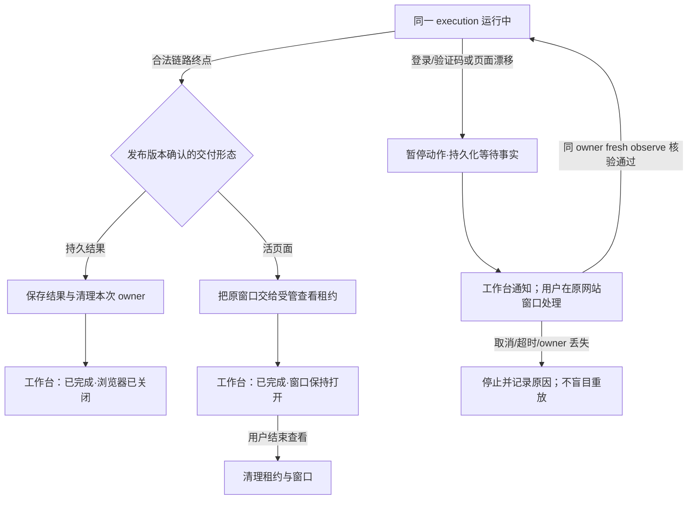

# 当天问题总账与下个 Session 修复交接

> 历史交接，更新标注于 2026-09-27：用户已明确授权并完成全部本地产品任务清空；本文的任务 ID、来源和 Release 不再可从本地查询。“本 session 不删除任务”等限制属于当时的工作范围，不能覆盖当前授权。已知失败结论保留，未知历史子因不补造。当前开发入口、实施顺序与退出门见[基础设施与主线开发方案](INFRASTRUCTURE_MAINLINE_DEVELOPMENT_PLAN_20260927.md)，最新事实见 [PROGRESS](PROGRESS.md#当前状态)；下方通用架构硬要求继续适用。

日期：2026-09-26。本文只记录只读核查、修复边界和验收条件；本 session 不修改产品代码、不删除任务、不重跑 B-U 或正式任务。架构以 [TASK_CHAIN_ARCHITECTURE](TASK_CHAIN_ARCHITECTURE.md)、[ADR 0011](../adr/0011-interview-produces-preparation-draft.md) 和仓库 `AGENTS.md` 为准；既有事实见 [PROGRESS](PROGRESS.md#当前状态)、[RESEARCH](RESEARCH.md#2026-09-26-动态候选域覆盖失败调查记录未实施修复)。

## 从需求到交付的问题总览

| 环节 | 当天问题及归属 | 当前结论 |
| --- | --- | --- |
| 需求对话与来源 | 普通用户只说要播最新一集，访谈 Skill 应根据完整对话和调查证据自行识别会改变结果的歧义；旧任务却把“最新”缩成“最新免费”，腾讯候选还忽略了同轮搜索中的反证。搜索事件未出现在 Timeline，来源题板冗长且一度显示错误的链接标题。 | **业务目标曾被错误改写；UI 问题已定位，正式新任务未验。** 已核实的详情页可以直接作为入口，用户没要求从首页搜索时不必强制补前置步骤；入口的真实性和目标语义仍须由证据与用户确认。见第三、六节。 |
| 草案交接 | 需求对话应产出唯一可确认的准备草案；宿主仅同版投影，不再生成第二份业务计划或网址。旧 Question 阻塞草案一次确认，当前 Skill 还含本次视频事故的固定剧本。 | **架构已确认，现行代码/Skill 尚未完成正式新任务验收。** 见第三、六节。 |
| B-U 与编译 | 另一新任务的 B-U 只调查当前 177–184 分组便误选 184；编译、样本和独立复验继承了错误来源。更早一次成功 B-U 的播放阳性观察又曾在编译时丢失，导致技术完成没有证明播放。首次 B-U/API 中断与同版第二次成功是第三种故障。 | **184 的错误环节已定位在 B-U；播放观察丢失是来源→编译合同缺口，已有定点修复但无修后产品验收；首次 API 退出的精确机制缺历史证据。** 见第三、四节。 |
| 正式复跑与用户交付 | 技术完成不证明选中了真正最新集、持续播放或留窗；现行 Runner 完成后关闭浏览器。登录/验证码的原位等待、跨任务通知和完成后查看入口也未闭环。 | **交付链路未通过。** 按确认草案的结果意图设计同一浏览器 owner 的交接与等待。见第二、三、五、六节。 |
| 工作台和服务 | 左侧只有归档没有彻底删除；旧输入框被错误禁用；`npm run dev` 的端口身份检查与手动 `npm run clean` 行为不同；旧可见 `read-fields` 仅存顶层错误。 | **分别定位，只有部分定点验证；不得说完整链路已修好。** 见第一、三节。 |

旧任务“最新免费”与新任务“184”是两层错误：前者是访谈 Skill 在需求/草案阶段未经用户授权缩小目标，后者是在目标已明确后 B-U 把当前页面局部候选当成全部候选。旧任务选到 180、用户指出 176–180 当时限免，是这次错误的现场反馈，不是永久剧集事实。访谈 Skill 应自己根据本次证据判断是否需要调查、何时提问和如何表达业务取舍；平台不增加会员、免费或剧集专用提问流程，B-U 和编译器也不替用户改目标。

另一个历史入口错误也属于需求→准备交接：任务 `60d9b658…` 的已确认需求没有来源决议或内容页 URL，旧准备模型却另外生成 `ss34430` 深链，B-U 首跳到别的作品。无需强迫用户规定“先首页、再搜索”；可以直达经过本轮证据核对的内容页。真正的缺口是确认后的第二轮模型增添了未经确认的入口。ADR 0011 的唯一草案同版投影正是为消除这条增添路径；现有定点代码和新任务样本不能反称所有入口已正式验收。

已有能力与待修缺口分开：B-U 新页恢复已接入单 Browser owner，headless 新页烟测 2/2；正式运行的单次 headless 开关已有合同/API 和运行证据。它们不解决 184 误选、编译播放证据丢失或运行结束关窗，本交接不得把它们作为新故障重做。较早的成功 B-U 已在所选目标页观察到 `media_playback=playing`，但当时自然编译未把该阳性观察写进对应动作的后置条件；`PROGRESS.md` 记录了同页相邻观察归属的定点修复及测试。修后没有全新正式工作台验收，因此“B-U 成功一定能正确编译”在当时被这个合同缺口推翻，不能仅凭 `gaps=[]` 或技术复跑 `completed` 宣称恢复稳定一次通过。

本次梳理过程也有一个已撤回的错误：在解释 API 退出与旧 `read-fields` 两处历史证据缺口后，突然用 `grill-with-docs` 询问活动任务删除方式，问题不属于同一批故障归因。技术原因不交给用户猜；只有剩余真正的产品取舍时，才一次提出一个决策、推荐选项及其后果。先前那道删除提问不作为本轮待答项。

## 开发规范与硬要求

1. 本 session 只修订文档；现有 `master@43ed385` 及其后全部未提交改动必须保留，不创建 worktree，不执行 Git reset/clean，不推送，不改相邻项目。
2. 平台只实现通用浏览器任务链路；网站、作品、剧集、会员、免费条件、页面结构与目标数量只能来自本次版本化任务事实，不能进入公共源码的固定规则或特例。
3. 需求对话由访谈 Skill 根据完整对话决定只读调查、搜索时机、业务相关性、重要歧义和提问方式；普通用户只需描述目标，不负责写 Agent 指令、网址、选择器、JSON 或详细操作步骤。
4. 宿主只限制工具、核验来源引用、持久化用户选择并投影唯一已确认准备草案；确认后不得再调用模型生成另一份业务计划、目标或入口。
5. 已核实的详情页可直接作为入口，用户没有要求的首页搜索路径不应被强加；未经本轮来源和草案确认的深链也不得由准备模型临时增加。
6. B-U 负责在真实浏览器现场调查目标、操作和观察结果；局部 DOM 查询或视觉片段不足以证明整个候选范围时，应在同一 job、同一 Browser/Agent 中补查或明确未完成，不靠重复整跑碰运气。
7. 编译只把 B-U 实际观察的动作、动态值和后态映射为参数化链路；它不能补猜未访问的页面、增添网站分页规则或把错误来源编成业务成功。
8. 普通复跑不得隐式调用模型，只有版本化链中的显式 `llm` 节点能调用模型；发布版本和历史运行不可被新脚本或后续修复改写。
9. TaskRun 的合法技术终点、execution 的资源清理、业务目标是否达成、用户能否继续使用交付现场须分别记录；登录/验证码等待和资源 `cleanup_required` 不得伪装成链路失败或完成。
10. 一个产品运行只占一个实际浏览器控制会话；仅清理可证明归本次 owner 所有的资源，不能关用户游戏、未知进程或他人 Profile，敏感页面、Cookie 和验证码不得写入 Git 或日志。
11. 遇到反复失败先查 SQLite、owner 诊断、服务进程和当前代码版本；旧记录缺退出码或内层异常就标明无法追认，补最小诊断后定点复现，不用 LLM 随机性或资源紧张猜唯一根因。
12. 非平凡能力先记录 `Product Alignment`，检查现有依赖、官方公开接口和成熟组件，必要时记录 `Reuse Assessment`；只做 B-A-T 独有的适配与版本化审计，不重写 Agent loop、浏览器驱动、图调度或恢复框架。
13. 跨包输入用 TypeScript/Zod 在边界校验，遵守代码文件 500 行、函数 100 行和嵌套 3 层上限；异步图推进沿用 LangGraph `StateGraph`，BrowserSkill 控制会话在 `finally` 关闭。
14. 只跑覆盖本次真实不变量的所属包定点验证，未经授权不跑根级或全量测试，也不反复运行同一组验证；已实现并有证据的 B-U 新页恢复与单次 headless 开关不列为重做项。
15. 最终验收只能从正式工作台的一条全新普通需求出发，逐门核对首次 B-U、首编译、样本、独立复验、手动发布、正式复跑及 UI/API/SQLite；旧任务、旧 Release、开发脚本改稿和同版第二次成功都不能冒充一次通过。
16. `grill-with-docs` 只用于查清技术事实后仍需用户决定的真实产品取舍，一次问一题并给推荐、互斥选项及后果；技术根因由开发者查证，不要求用户猜。
17. BrowserSkill/browser-use 只提供受控浏览器能力；B-A-T 自己负责编译、持久化、版本、运行、恢复和审计，不把正式链路复跑交回浏览器 Agent。
18. 开发主 agent 使用本 session 选定的模型与 reasoning effort，子 agent 继承且同时最多两个，不由项目文件或派发私自覆盖。
19. 结构查询优先 CodeGraph，字面文本才用 `rg`；项目命令明确以当前 checkout 根目录为 workdir，不扫描 `node_modules`。
20. 工作台异步操作在触发后立即给状态反馈，运行事件按本次 execution 绑定，不能把不同运行的节点事件拼成一条成功轨迹。

## 现场与结论

- 现有 checkout 为 `master@43ed3851636e748aed973df67fd1c61bc76e96eb`，大量已有未提交改动必须保留。核查时 4173/4175 由同一开发服务监听；没有更改服务、相邻 OpenCode checkout、Git 状态或用户任务。
- 2026-09-26 09:27 UTC 再次只读核验：4173/4175 均由 PID 8888 的本项目 `node.exe` 监听；4175 `/api/health` 返回 `browser-capture-api` 和正确的 `development.pid/root`，`inspectDevPorts({web:4173,api:4175},{root:cwd})` 通过身份核验。此为当时快照，未关闭或重启服务。
- 最新正式新任务 `449e20e7-91aa-46ed-bac1-2cdc93b0ad8c` 的 Release V1 为 `8c1fb9f5-1350-4d1b-8b61-cc170ae11ac3`。最新一次只读核验见 execution `44c2b166-1c86-4013-8881-77872484b9b9`：`completed`、cleanup `confirmed`、`result.payload.evidence=[]`，同一 V1。它既没有证明当次选中哪一集，也没有给用户留下可观看的窗口。较早的 B-U 来源已证明只读 177–184 分组并误选 184；V1 的业务目标失败，不能用后续技术完成记录补称正确。
- 当前发布后反馈 job `9e0000d1-86c4-4c42-88ee-99d61f47b693` 仍是 `requirement_revision/waiting_for_human`，要求重问是否核查全部分组；已确认需求本来就要求“最新已发布正片，不能看则停下、不改播旧集”。这是错误的修订分流，不应让用户重复回答。

## 一、左侧列表增加真正的“彻底删除”

**现状及根因。** 左侧显示的是 task/session 列表。`apps/workbench/src/TaskSidebar.tsx:12-33` 只有归档菜单；`packages/contracts/src/task.ts:7-16` 只有 create/rename/archive；`apps/api/src/app.ts:150-155` 没有任务 DELETE 路由；`apps/api/src/database/store.ts:109-124` 的归档只改 `tasks.archived`。因此用户无论在最近任务还是已归档区操作，都无法永久删除。

**相邻项目只读参考。** OpenCode 的 `SessionSidebar.tsx:123-142,423-434` 提供显式 Delete；`useSessionList.ts:176-201` 等服务端成功后才从列表移除，失败时保留可重试状态；`ChatContext.tsx:587-613` 删除当前会话后重置选择。服务端 `vertical-server-session-routes.ts:27-35,138-152` 先中止活动运行并释放运行态，再删 transcript/cache；`vertical-server-runtime.ts:86-96` 清 waitpoint、checkpoint 等私有状态。参考其交互与所有权顺序，不能直接复制它的数据删除代码到 B-A-T。

**可直接复用的实现。** B-A-T 已固定依赖 OpenCode 的 `@agent-platform/pi-agent-session` 0.1.0 tarball（`apps/api/package.json:18`）。该包正式导出的 `./platform-internal` 含 `PiAgentSessionBindingStore`、`deletePiSessionData`；B-A-T 访谈的 Pi sessionId 为 taskId，探索的 Pi sessionId 为准备 jobId。应写薄适配调用现有删除能力清这两类 Pi 私有状态，不重写路径校验和文件删除；因为 `platform-internal` 的稳定性弱于根导出，须固定版本并做定点验证。现成的 `BrowserService`/`cleanupOwned(expectedRunId)` 已能按 owner 精确清浏览器，删除流程应复用，不能另写进程杀手。OpenCode 的 DELETE 路由、Bun/Hono runtime、SDK hook 和 Sidebar 组件不适合直接依赖：B-A-T 是 Fastify、SQLite/Drizzle、现有 Radix 列表，任务数据归属也不同。Pi 删除若在“移除 binding→删除文件”之间失败，需核验残留并给可重试诊断，不能仅凭函数返回就宣称彻底清除，也不能越界扫目录。

**B-A-T 修复边界。** 左侧提供明确的“永久删除”及不可逆确认；成功后才刷新列表并切到其他任务。服务端先给目标 task 加删除互斥，确认没有活动访谈、准备、execution、`cleanup_required` 和未释放的 browser owner；活动时明确拒绝或先走现有合法取消/清理流程，不能只看左侧标签。SQLite 已开启 foreign keys，任务关联表没有级联删除，须在一个事务中按外键顺序清理由该 task 拥有的访谈消息/草案/轮次/Question/来源决议与审计、browser/research runs、plan/chain、任务合同、authoring job、draft、release、execution/candidate/cleanup audit/artifact、workspace sequence，最后删除 task。`operations` 是全局幂等表，须按可证明的 task 归属清除对应键，避免同请求返回已删 ID；不能删除全局 `aiSettings` 或别的任务的共享来源访问限制。数据库外的 `browser-owner.json` 与追加型 `browser-audit.jsonl` 也要按 owner/task 精确处理，不能删整份全局日志或别的任务的 Profile。实际表与归属以 `apps/api/src/database/schema.ts`、`migrate.ts`、`packages/browser/src/journal.ts` 为准；旧迁移已移除的表不得当成现行对象。

**验收。** 删除一条无活动任务后，当前与归档列表、任务 API、SQLite 各任务专属表、幂等结果和浏览器外部记录都不再保留该 task；重启仍不存在，其他任务及全局设置逐项不变。活动运行、待清理和 owner 不明各应拒绝删除并显示可操作原因；失败时 UI 不先移除。只在隔离的新测试任务上验收，不拿用户现存任务试删。

## 二、可见运行完成后保留页面供用户观看

**现状及根因。** `headless=false` 只让执行过程中的窗口可见。正式运行经 `apps/api/src/task-chain/runtime-host.ts:239-249` 进入 `withHybridCapabilities`，后者在成功/失败后均 `runner.close()`（`apps/api/src/upstream-browser/hybrid-runtime.ts:138-146`）；Python `HybridRunner._close` 执行 `browser.kill()`（`apps/api/python/browser_use_runner/hybrid_main.py:401-435`），当前 Profile 还显式 `keep_alive=False`（同文件 153–162）。SQLite 的旧正式 execution `a67b6ccd-5607-4827-8904-210d40762b84` 清理审计记录 `browser_close=confirmed`、`child_exit=confirmed`、`activeResources=false`。所以运行完成就关窗是确定的实现行为，不是窗口设置没选对。`ChainRunDialog.tsx:71-75` 只有单次 headless 开关，没有结果留窗或结束观看入口；登录态专用 `BrowserProfileDialog` 不能代替结果窗口。

**目标语义。** 对用户选择可见执行、且结果需要持续查看/播放的任务，动作链合法完成后页面继续保持在用户面前，直到用户显式结束观看或关闭窗口。TaskRun 是否完成、execution 的运行资源是否清理、用户可见窗口是否仍开放是三种事实；“窗口还要看”不能伪装成 `cleanup_required`，也不能在标记清理 confirmed 时暗中杀掉唯一可见页面。BrowserSkill/自动化控制会话仍必须在 `finally` 关闭，一个运行只占用一个控制会话；用户可见窗口的所有权和停止入口需明确交接与单独审计。不能仅把 `keep_alive` 改为 true 或删掉 `runner.close()`，那会破坏清理与占用边界。具体交接方式须先核验 browser-use 的公开生命周期接口和 Windows 真实行为，再冻结方案。

**按已确认的交付意图决定，不按网站或关键词分支。** 用户要求可独立取用的文件、数据或回执，还是要求继续使用原浏览器现场，应由访谈模型根据完整对话判断，并在会改变交付时用业务语言确认；不能把“播放”“下载”之类动词变成自动留窗或关窗条件，也不让用户填写技术性留窗开关。对本次任务，用户后来明确说要继续观看，因此下一份草案应如实写入原现场交付，用户确认后宿主只做同版投影；B-U 检查现场可行性，正式运行按发布版本执行，不临时用 LLM 决定关窗。本次任务 v1 的草案、Requirement、Release 只有“已开始播放/完成状态”，没有交付后留窗约定，不能从 `completed` 补写成已交付。登录/验证码属于执行中等待，不是完成后交付；`headless` 与留窗目标冲突时须在启动前提示。

**优先复用的设计。** `BrowserProfileService` 已有 owner、占用仲裁和显式关闭模式，但当前 `shutdown()` 会关 Runner，不能直接复用其实例做观看租约。固定版本 browser-use 0.13.8 的公开 [`BrowserProfile.cdp_url/is_local`](https://raw.githubusercontent.com/browser-use/browser-use/0.13.8/browser_use/browser/profile.py) 可连接已有浏览器；[`BrowserSession.stop()`](https://raw.githubusercontent.com/browser-use/browser-use/0.13.8/browser_use/browser/session.py) 负责停止控制会话，而 [`LocalBrowserWatchdog`](https://raw.githubusercontent.com/browser-use/browser-use/0.13.8/browser_use/browser/watchdogs/local_browser_watchdog.py) 会在它自己拥有本地进程时处理 Stop 并派发 Kill。因此优先验证一个独立的 B-A-T 浏览器 owner 持有原进程、browser-use 经公开 CDP 入口附着、运行后断开控制而 owner 把原窗口转为用户查看租约；借用现有 Profile 占用/清理边界，不复制浏览器驱动。它是待 Windows 最小真样证实的适配方案，须核对窗口存活、播放连续性、Profile 锁、服务重启后的 owner/PID 核验和结束查看的定点清理。单改 `keep_alive` 或正常关闭后重开 URL 都不能证明原页面持续播放。

**验收。** 正式工作台一次 `headless=false` 运行完成后，实际目标页保持可见、播放器画面可继续推进；用户结束观看后窗口及拥有资源有清理事实。headless、失败、取消、服务重启和同 Profile 再次运行各有明确结果，不会无提示关窗、留下孤儿进程或让两个控制会话争夺同一 Profile。B-U 代表试做和自动样本/独立复验仍按各自受管生命周期关闭，不把验证窗口冒充交付给用户的窗口。

## 三、当前剩余错误与证据缺口

| 状态 | 问题与已证实根因 | 下一步边界及退出证据 |
| --- | --- | --- |
| **失败，P0** | B-U 在当前视图只读 177–184 后点 184，把单次查询未截断误认为已调查“最新”的全部相关页面。编译器忠实映射了这条轨迹；其读取、函数、点击一致性检查通过不是业务范围正确的证明。样本与独立复验重跑错误链，不能证明最新。 | 先修 B-U 通用现场调查提示，并在同一 job、同一 Agent/Browser 里对临时完成做有界复核及具体缺口续查；查不清则来源未完成。先定点验证二次 run 的 trace/预算，再用非网站特例的多视图样本及一个全新正式任务验收。编译保留技术一致性职责。 |
| **失败，P1** | 用户反馈“184 不是最新”被模型路由到 `requirement_revision`，要求重复确认原草案已说清的范围；现有调整 prompt 对“范围改变”与“技术路径没看全”的区分不足，调整端也没有进一步调查页面事实的清晰承接。 | 用已确认草案与反馈对照：需求未变时留在链路修订/重新准备，由 B-U 补技术证据；只有用户改变目标、来源、范围或结果预期才回访谈。现有等待问题保留为错误证据，不代用户回答、不改写旧 Release。 |
| **未通过一次性验收，P1** | 同一新任务的访谈 revision 3 因旧 Question 在草案准入前未 supersede 而失败；代码已定点修复并经工作台重试产生 revision 4，不能计为一遍成功。首次来源题板又丢失真实搜索标题、显示“点击观看/追番”；解析修复有定点测试，但旧任务事实不改，新任务产品效果未验。 | 从普通用户一句话开始，仅当需要才只读搜索；Timeline 展示查询及证据，Question Panel 用可读来源摘要而非整段原文；业务歧义由访谈主动问，唯一草案首次可确认。确认后只投影内部合同，不再生成业务计划/网址/目标。 |
| **未证明结果，P1** | 当前 V1 最新 execution `44c2b166-1c86-4013-8881-77872484b9b9` 虽 `completed`/cleanup `confirmed`，`result.payload.evidence=[]`；当次选中目标、最终 URL 和画面时间推进均无用户可核对事实。 | 在现有动作/观察输出中保留足以审阅动态选择和目标后态的结构化事实；技术 `completed` 仍只表示合法图终点，用户是否满意独立记录。正式可见复跑需另有实际画面观察。 |
| **历史根因未追认，定点复核** | 旧可见模式 `browser.read-fields` 失败记录只有顶层 `RuntimeError`，无法从旧事实追认 CDP/页面子因；内层阶段安全码及故障注入测试已补，但同条件真实可见路径未复现确认。旧 API 中断的精确退出机制也缺 stderr/退出码，不能归咎于用户游戏。 | 只有再次出现相同错误才按新诊断码查对应阶段；优先查持久化错误与服务资源，再做最小复现。不要为旧未知错误整跑或加网站兼容特例。 |

两类 `read-fields` 失败不能合并：旧可见 execution `6771d738…` 的第三节点已用相同 ReadSpec/scope 成功，第四节点才只留下顶层 `RuntimeError`，所以“规格本身必然超限”已被排除；旧记录没有内层异常链，无法事后区分 CDP、页面漂移、字段投影或读后观察。另一任务 `b3726b40…` 的样本 `hybrid_read_inner_pre_scope_value_error` 已定位为同文档 URL 变化后仍沿用静态 scope，当前代码有同文档证据下的运行时重绑修复和定点测试；它不证明旧可见错误的原因，也未经过新任务完整验收。首次 B-U/API 中断则有 Python 完成写回和 TS 收到响应的日志，故障窗口在响应接受/来源保存之前；当时提交余量约 98 MB，缺退出码、stderr 与最后阶段记录，不能唯一追认退出机制。

“同版草案第二次试做成功”也已核对到版本与进程：首 job `e27d9627…` 与第二 job `f6d17aa7…` 的 Requirement/Plan 版本、摘要相同；第二次前 API 已重启为 PID 23684，且加载了新的 `interrupted` 恢复准入代码。第一次 B-U 有 9 个动作/12 次模型调用，第二次为 8/11，路径确实不同，但首次故障发生在 Python 已写回、TS 已收到响应之后，**不能据此判定是 LLM 输出差异引起 API 退出**。后来针对响应后关闭顺序的 `closeAfterResponse` 改动发生在第二次完成之后，不能倒称第二次靠它成功。两次不构成“代码、进程、环境完全相同”的对照实验。

对首次退出当晚 20:15–20:25 的 Windows 事件做了定点复核：System 中有 20:16:18 与 20:21:44 的资源耗尽事件 2004，Application 对 1000/1001/1002 崩溃/报告事件的同窗口查询无结果。它加强“资源紧张”的现场证据，却仍不提供 Node 退出码、stderr 或具体终止调用。历史精确退出机制无法由现存记录唯一恢复；下次只有同类故障再出现时，须在 owner/API 边界持久化进程退出码、受控 stderr 安全码、最后完成的接受/校验阶段及响应摘要，才能把资源耗尽、程序异常和外部终止区分开。这里不要求重复整跑旧任务。

更早的腾讯来源题板已定位：旧任务 `a40711c9…` 的模型搜索词含“腾讯视频”，同轮原始结果却含哔哩哔哩独家反证；模型仍提交两个腾讯 URL，宿主旧题板又把首项标成推荐。它和新任务 `449e20e7…` 的“点击观看/追番”标题错误不是同一故障：新任务的同 URL 来源列表有作品正式标题，旧解析器先遇动作链接便保留了动作标题；当前未提交代码已有同 URL 正式标题覆盖修复，尚无新任务 UI 复验。

截图中的搜索 Timeline 缺展示也已追到投影层：任务 `6416bb34…` 的持久化消息确有 `web_search` 开始/完成事件，旧 `interviewTimelineProjection.tsx` 只放进 hooks，没有生成可见 entries。当前未提交代码已新增搜索 entries，但正式 UI 未复验。长 Question Panel 来自 `sourceQuestion` 把真实候选的冗长 `description` 原样拼进选项；当前未提交代码把题板预览收至 88 字并保留原始证据，真实 UI 仍待验。旧输入框问题曾定位为 `cleanup_required` 被误投影成 executing 而禁用输入，代码有定点修复。2026-09-26 只用隔离 Chrome 打开正式工作台任务 `6416bb34…`，点击其共享输入框并插入未发送文本：`disabled=false`、实际获得焦点且文本进入；浏览器已关闭、无任务消息/API 写入。此定点结果证明**新开页面**当前可聚焦输入，不追认旧截图窗口的缓存状态，也不证明发送链路。

`npm run dev` 当初报“身份不完整”的直接原因已在 `scripts/dev.mjs:217-225`：自动启动守卫要求占用者的 PID、进程名、命令行和入口目录俱全；旧 API 用相对入口启动，健康响应又未提供可采信的开发身份，守卫安全拒停。用户明确要求的 `npm run clean` 走另一条已实现路径：只取 4173/当前 API 端口的监听 PID，二次核对初始 PID 不变才停止；它**不调用**上述命令行/目录身份检查，因此“身份不完整”本身不阻挡手动 clean。空端口、临时监听进程和 PID 变化已有定点验证；当前正在使用的服务不可为验证而清掉。历史 `blocked by policy` 是自动审批拒绝重启命令，命令未执行，并非 API 返回的服务错误；当前服务进程和加载版本须按现时监听及进程核验。旧 API 意外退出仍缺 stderr 和退出码，资源紧张只是当时的事实，不能宣称已确定退出机制。

## 四、B-U 首错如何修：在原浏览器里完成现场调查

**已证实的错误链。** 本次新任务 B-U 来源 `6b6b9e2f…` 在 `a-0002` 用 `find_elements('li[title]', max_results=100)` 读到当前视图的 10 项（两个模式项、177–184 八个正片）；`complete=true` 仅表示这次 CSS 查询未截断。B-U 在 `a-0003` 选了 184，未在保存的 trace 中调查其他页面范围。现有 `author.py:251-253` 提示模型调大 `max_results` 以覆盖“complete candidate list”，容易把局部查询当作业务范围。编译器随后只核对已记录读取、函数选择与点击是否一致；它看不到 B-U 未打开的范围，也不应承担补查页面的职责。此前“同版草案第二次试做成功”属于另一任务的 API 中断事件，不能拿来解释或冲抵这次 184 误选。

**修复位置与方式。** 先把 B-U 通用提示改为：动态选择前应根据已确认草案，调查页面是否还有可能改变结果的可见入口或状态；一次 `find_elements` 完整仅代表当前查询完整。页面可能通过分组、筛选、加载更多或其他方式组织内容，提示不指定某一种页面结构。若现场仍无法判明，来源明确未完成；新业务歧义回需求对话，不能由 B-U 私自缩小目标。

在首次 B-U 临时 `done` 后、Browser 与采集器关闭前，基于**同版草案、完整探索轨迹和原页面新观察**做一次有界完成复核。若指出具体漏查入口，使用 browser-use 0.13.8 的公开 `Agent.add_new_task` 和同一个 Agent/history/Browser 继续原 job，再取得最终 `done`；不要重启一整个 B-U 试做，也不要在 `AuthorTools.done` 中藏一套业务判定。内建 `use_judge` 只附 verdict，不会推翻完成声明或自动续做，不能简单打开就称修复。[上游 Agent 实现](https://raw.githubusercontent.com/browser-use/browser-use/0.13.8/browser_use/agent/service.py)。这仍是 B-U 阶段的模型调查；普通发布链复跑不隐式调用模型。

**实施前的定点验证。** 先核对二次 `run` 的总步数预算、回调 step_number、collector 轨迹连续性和首次临时 `done` 的处理；再用与网站无关的多视图样本验证：第一视图有局部最大项，另一视图有符合目标的更大项，B-U 必须在同一 job 续查并纠正选择。复核模型仍可能漏看，不能承诺形式上的全站完整性或 100% 首次成功；出现未查清的具体疑点应报告准备未完成。编译继续做现有技术一致性检查，不新增分页逻辑、候选域证书、跨组循环或业务范围准入门。

Product Alignment:
- natural-language task: 按已确认动态目标，现场调查相关页面并操作真正符合目标的对象；无法判明时报告未完成。
- reusable chain boundary: 需求对话确认目标 → 同 job B-U 现场探索与纠错 → 现有编译技术映射 → 无隐式模型的正式复跑。
- runtime inputs: 已确认草案、B-U 页面观察与本次浏览器状态。
- dynamic task outputs: 本次选择、动作后态、来源轨迹或未查清原因。
- generic platform capability used: browser-use 原生 Agent/Browser/add_new_task、workflow-use 现有证据和编译接口。
- replay model calls: 0，显式 LLM 节点除外。
- site/task-specific code added: no。

## 五、交付判定、人工等待与通知：现状和应接通的边界

**当前系统实际判断。** `TaskRun` 沿合法链路到终点且无节点/合同/运行错误时为技术完成；`execution-result.ts:8-27` 把空输出合同投影为 `mode=execution` 的完成步骤数与 evidence，把非空合同投影为 `mode=data` 的输出。最新正式 execution 的 evidence 仍为空。当前合同只有单次 `headless` 开关，没有“交付后保留同一页面”的版本化字段；`withHybridCapabilities` 每次在 work 返回后都会关闭 Runner。因此不能从现有 `completed`、`mode=execution` 或 `headless=false` 倒推出“用户已拿到可观看结果”或“现在应该关窗”。用户在工作台的“符合预期”反馈是另一件事，不得改写技术终态，也不得加全局语义 judge。

**交付意图从哪里来。** 它不是运行事实，也不是编译器/复跑现场由 LLM 推断出的分类。访谈 Skill 的 LLM 根据普通用户需求和完整对话确定用户要得到什么，必要时以业务语言澄清；它将“完成后用户仍需使用原浏览器现场”等结果意图写进唯一准备草案。用户确认草案版本后，宿主只投影为通用交付合同并随 Release 固定。对这次“帮我播放最新一集”，持续可观看是用户话语和后来反馈已经明确的目标，访谈本应写入，但持久化 v1 并未写入；旧 Release 不可暗改，须在新确认版本中补齐。B-U 只调查现场能否达到目标，正式复跑不靠 LLM 判定去留。真正的运行事实则是链路是否完成、窗口是否仍在以及画面是否推进；这些要分开观察和记录。

**现在的人工拦截缺口。** B-U 的 browser-use `Agent.run` 没有接通生产准备 job 已有的 `waitpoint` 字段；登录/验证码通常以失败文案要求去专用 Profile 登录后重新准备。正式 hybrid 仅把文档 HTTP 401 类型化为 `human_required`（403/429 为受阻）；它已能经 `result-routing.ts:33-41` 保存 TaskRun checkpoint/waitpoint，并在工作台显示“处理后继续”，但 `hybrid-protocol.ts:24-33` 没有人工交还命令，`withHybridCapabilities` 随即关闭原浏览器。含点击的链路恢复要求同 session/tab，换新浏览器登录后不能安全原位继续。返回 HTTP 200 的登录跳转或验证码页目前没有通用类型化识别，常表现为目标缺失/页面不符；不能把任何目标缺失都冒充验证码，也不能让普通复跑暗中调用模型判断。

**最小复用设计。** B-U 复用其现有 Agent/浏览器 owner，把准备 job 的既有 `waitpoint` 真正接到同一可见窗口：发现真实登录/验证码后暂停并持久化，用户在目标网站原生页面处理，点击“处理后继续”才 fresh observe；继续同一个 job，未处理前不能产生成功来源。正式复跑复用现有 `human_required`、TaskRun checkpoint、RunnerProcess 和 owner/占用仲裁，在 hybrid 适配层补人工暂停/交还能力；识别到明确 401 或真实页面挑战时保留原 owner，用户处理后在同 session/tab 核验恢复条件，不重发已完成的副作用。无法明确识别的 HTTP 200 异常页面按“路径与预期不符”暂停供人查看，不能猜成已登录或自动重试；服务重启丢失原 owner 时仍走现有恢复安全门，无法证明同一现场就报告不可原位恢复。查看租约、人工等待租约和自动化动作共用一个 owner，不再开第二个浏览器控制会话；结束、取消、超时和崩溃清理都按 owner 记录并核验。

**用户接触面。** 目标浏览器只显示网站自己的登录/验证码页面，用户在站点内输入，不把密码/验证码送入 B-A-T。工作台才是任务通知与操作入口：从持久化 execution/job 事件投影任务列表角标、跨任务可见的待处理卡、当前任务状态条和一次性完成/失败提示；待处理卡给出任务、原因、可操作动作“聚焦该浏览器 / 处理后继续 / 取消”，完成卡给出业务结果或“页面仍打开 / 结束查看”。现有 UI 只有任务内状态、轮询和恢复按钮，没有全局待处理或 OS 通知；桌面通知可以是经用户许可后的附加提醒，不能充当唯一通知或状态事实源。运行时业务歧义才回需求 Question Panel；登录/验证码是执行等待，不能塞进需求题板。

**用户实际看到的状态与动作：**

| 已确认意图与本次观察 | 工作台上的固定状态卡 | 目标浏览器 |
| --- | --- | --- |
| 动作完成，交付物已保存 | “已完成；结果可查看；本次浏览器已关闭” + 查看结果/再次运行 | 关闭；旧页面不再当交付物 |
| 动作完成，交付物是活页面 | “已完成；结果窗口保持打开” + 切到窗口/结束查看 | **原窗口、原页面继续存在**；用户结束后再清理 |
| 可见运行遇到明确登录/验证码 | “等待你在网站处理” + 聚焦原窗口/处理后检查并继续/取消 | **原窗口保持**，用户直接在网站内处理；工作台不收秘密 |
| 200 登录跳转或未知页面漂移 | “页面与预期不符，需要查看”，不擅自写“验证码” | 暂停自动动作，原窗口供用户确认 |
| headless 遇人工、或重启后 owner 丢失 | “无法交还原窗口；本次不能安全原位继续”，按检查点说明可恢复/需新运行 | 不暗开第二个控制会话，不重放已完成副作用 |

`TaskRun` 的链路技术完成、execution 的自动化清理结论、交互交付是否可用及用户查看租约的开/关须分别记事实。执行资源只有在**可核验地转交**查看租约后才从原 owner 释放；不能把“窗口还开着”写成 `cleanup_required`，也不能把未关闭浏览器写成 `browser_close=confirmed`。当前 `keep_alive=False` 且关闭调用 `browser.kill()`；留窗交接需先用固定版本 browser-use 做 Windows 最小真样，不能只靠改文案或跳过 `runner.close()`。

Reuse Assessment:
- capability: B-U 同现场调查与有界续做、同一浏览器 owner 的人工等待与完成后可见交付。
- existing implementation in repository: browser-use Agent/Browser、workflow-use 的 author/capture 与现有编译技术检查、TaskRun checkpoint/`human_required`、`TaskAuthoringJob.waitpoint`、RunnerProcess、BrowserProfileService 的 owner 模式、工作台执行事件与 Radix 组件。
- mature candidates and pinned versions: 当前 vendored workflow-use 与 browser-use 0.13.8；先核验其公开生命周期和本机 Windows 行为。
- selected implementation: 扩展上述证据/适配边界，复用现有链路图与 owner；不建第二个 Agent loop、浏览器驱动、图调度器或通知状态机。
- reused public surface: browser-use 浏览器/Agent 能力与既有 Runner 协议；不得靠私有回调维持新生命周期。
- B-A-T-owned adapter and remaining gap: B-U 同 Agent 续做的模型审计、步数和 trace 衔接；人工等待的同 owner 交还；确认草案的交付意图同版投影与查看租约；工作台统一状态投影。
- license/runtime/platform fit: 沿用已固定依赖；具体留窗方式须在 Windows 最小真样核验后冻结。
- browser/runtime/state ownership conflicts: 任何人工等待或留窗不得启动第二控制会话；清理与查看租约分别审计。
- replay model calls: 0，除链路显式 LLM 节点外。
- rejected candidates and evidence: 调大 `max_results` 或只打开 browser-use judge 不能完成 B-U 漏查；编译分页/候选域门无法重建当时现场；`headless=false` 或 `BrowserSession.stop()` 的名称不能证明留窗，browser-use 0.13.8 本地 watchdog 对 StopEvent 仍可能派发 KillEvent。
- focused validation: 二次 Agent.run 的步数/trace 协议与通用多视图 B-U 纠错；同 job B-U 人工续做；含点击正式链在 401/200 异常页面等待后同 owner 继续；完成留窗与结束清理；跨任务通知及重启失主安全门。

## 六、组合结果与交互交付：同一草案贯穿整条链

**现行断点。** 访谈 Skill 允许从最终结果理解“状态到达”等任务，但草案的 `- 交付：完成状态/数据结果` 只能二选一；`parsePreparationDraft` 只投影这两种输出，`TaskPlan`/Release 没有交互交付合同，`TaskExecutionResult` 也只显示 execution/data。B-U 已能记录部分页面后态，现有编译还会把有依据的 `media_playback=playing` 绑到动作后置条件；这些都没有告诉运行资源层“把哪一个仍活着的页面交给用户”。正式 Runner 因而照旧关闭。这是从需求到交付的合同缺口，单独留窗开关补不齐。

**最小通用表示。** 一个任务的结果可以同时包含结构化值、文件/回执等已有结果和一个需要交给用户的活浏览器现场；“需要登录/验证码处理”则是运行中的人工等待，不是最终结果类型。不把“交互”加成与 `execution/data` 互斥的第三种业务模式，也不写“视频/剧集/分页”公共规则。新确认草案在“结果与完成”用普通业务话语说明最终用户实际拿到什么、是否需要在原页面继续观看/阅读/操作、由谁结束；再带一条可机械投影的通用浏览器交付标记（保留现场/无需保留）。用户审阅并确认整份草案。宿主只把同版标记投影到 `TaskPlan` 的独立交付字段，Release 原样冻结；旧版本只读兼容，缺失不能猜成已要求或已完成留窗。现有 `outputContract`/`resultSpec` 继续描述数据，交互交付与它并列，因此“数据加活页面”可组合。

**撤销硬编码的业务剧本。** 访谈模型依据用户原话、完整对话和必要的只读调查判断最终交付；宿主只校验草案结构与已确认事实，不按“播放/下载/查询”等词自动选择留窗或替代目标。当前 `.agents/skills/interview-browser-task/SKILL.md` 的“同名作品/播放对象/单条内容页”定向例子（约第 41 行）和“最新一集→会员资格→免费替代→再确认”的整段固定流程（约第 54 行），是把本次事故处置写进了通用 Skill；后续修复应删除这些实例化步骤，不再以改写措辞的方式保留分支。Skill 只表达通用职责：调查会影响结果的事实，不能暗改用户目标；事实涉及用户自身资格或选择替代目标时由用户决定。何时查、查什么、是否需要提问、交付什么，由访谈模型按本次证据决定。下文视频例子只记录本次用户已明确的预期，不生成通用模板。草案标题和字段类型属于同版接口语法，不能被拿来驱动业务判断。

**链路组合边界。** 一个可交付状态可以由同一条参数化链路内的导航、动态读取、选择、动作、观察顺序到达；链路终点绑定实际结果值和本次目标页，执行资源层随后完成交接，不另加“handoff”浏览器动作或把最终交付冒充人工等待节点。当前 `projectPreparationPlan` 只投影一个 `main` 步骤；若草案确有多个可独立验收且有先后依赖的结果，后续须从**同一草案的高层依赖**确定性投影多步并各接一条链，暂不能宣称现有单步投影已支持所有组合任务，也不得再调用模型生成第二份业务计划。

| 环节 | 需要做的具体调整 | 本环节不能做的事 |
| --- | --- | --- |
| 需求对话 Skill | 从普通需求确定交付物、用户是否要继续使用现场、动态结果如何让用户判断；真正有歧义才用业务 Question。本次用户已明确要在播放后继续观看，下一版草案须如实表达该交付意图。 | 不要求用户提供技术开关、selector、URL；不从任务类别或关键词推出留窗决定。 |
| 确认与内部投影 | 草案解析器只校验通用交付标记与正文不矛盾，形成与 `outputContract` 正交的版本化 `browserHandoff`；Requirement→Plan→Draft→Release 保持同版摘要。草案缺少会改变交付的意图时返回对话，不在投影时调用模型补写。 | 不把 `headless`、`resultSpec.mode`、动作名称或网站词汇当成留窗意图。 |
| B-U 代表试做 | 按完整草案在真实页面完成动态选择、动作及最终观察；采集所选对象/结果值、动作前后状态、可交付页面的实际 tab 身份与页面观察、登录/验证码等现场限制。浏览器仍在时核对会改变目标的其他可见入口；新业务取舍返回需求对话。 | 不自行决定交付物、不把局部查询当全集；不把 B-U 的临时 tab ID 当未来复跑的固定 ID。 |
| 编译链路 | 复用现有动作、读取、值绑定、后置条件和 gap：把 B-U 已观察到的选择/结果编成参数化链，绑定运行时选中对象、结果值与最终可交付页面的**运行时**目标引用。已有播放后置条件继续由现场事实支撑。缺少必要技术绑定时报告编译 gap。 | 不重建 B-U 未见过的页面，不新增分页业务门、隐藏模型或链外完成 judge；浏览器交付是发布版本的输出/生命周期合同，不是第二张图。 |
| 样本、独立复验、发布 | 分别验证链路合法终点、结果值绑定和可交付页引用能在不同运行中解析；自动验证用受管浏览器并正常清理。手动发布冻结同一计划、链与交付合同。留窗本身另做最小 Windows 生命周期真样。 | 不用 B-U 的目标页、样本窗口或旧 Release 代替正式用户交付。 |
| 正式运行与资源层 | 成功终点后按 Release 交付合同处理：无需现场则现行清理；需要现场则先核验本次运行的目标页绑定、窗口存活和 owner，再把**同一个**可见浏览器交给受管的用户查看租约，释放自动化控制会话，用户结束查看后清理。若无法交接，保留 TaskRun 技术结论并记录交付失败，不报“可观看完成”。`cleanup_required` 仍只表示清理未确认。人工拦截走等待/恢复，不算完成。 | 不靠复跑 LLM 临时判断去留，不另开第二个控制会话，不仅删 `runner.close()` 或改 `keep_alive`。 |
| 工作台与持久化 | 结果卡同时显示业务输出、链路结论和交互交付状态；活现场显示“切到窗口/结束查看”，登录验证码显示“聚焦原窗口/处理后继续/取消”。API/SQLite 持久化不含秘密的租约 ID、owner、目标页摘要及 active/ended/failed 事实；重启后核验，不把已丢失窗口显示为仍可观看。 | 不把 `completed`、`mode=execution` 或 `headless=false` 投影成“页面仍可见”。 |

以本次“播放最新一集”且用户后来明确要继续观看为例：下一版草案须表达“运行时最新已发布正片；若访问受限则停下，不自行改播旧集”，并记录实际选中对象与播放后态、交付原页面供用户继续观看。这是本次已确认业务含义，不是其他播放任务的模板。若结果卡承诺展示实际选中标题/集数及播放状态，这些就是 `数据结果` 字段；保留页面是与字段并列的交互交付。B-U 从真实候选读取、选择动作、播放后态取得各字段的来源和最终页；编译把字段绑定到正式运行的读取/函数/观察，不从 B-U 的 `done` 文本复制固定集数；正式运行输出本次值并交付本次原窗口。

**B-U 实际观察方式。** 当前作者 `Agent(use_vision=True)` 接收视觉信息，同时用 Browser-Use 的 DOM 元素动作和 `find_elements` 读取候选；`screenshot` 主动动作被禁用不等于视觉观察被关闭。两种输入都不能自动证明已看遍业务总体：那次误选的关键是把当前页 `find_elements` 的查询完成误认作完整候选覆盖。后续修正应针对 B-U 的调查完整性及其证据，不能归咎于单纯“用视觉”或“用 DOM”，也不能在编译器里补猜未访问页面。

当前 `BrowserProfileService` 可借用 owner、互斥和显式关闭模式，但其 `shutdown()` 会关闭 Runner，不能原样充当留窗服务。需先在固定 browser-use 0.13.8 与 Windows 真样核实“控制会话在 `finally` 关闭、原浏览器窗口仍由 B-A-T 明确持有”的公开接入/脱离方式，再冻结租约适配；失败时不能用重开 URL 冒充原播放现场。

Product Alignment:
- natural-language task: 用户可要求保存结果、交付仍可使用的网页，或同时得到二者；“播放最新一集”要求最新目标真实开始播放且页面留给用户继续观看。
- reusable chain boundary: 同版草案的输出/交互交付意图 → B-U 现场证据 → 参数化链与运行时目标绑定 → 发布版本驱动资源交接。
- runtime inputs: 已确认来源与动态输入、运行时页面/账号状态、发布版本的通用交付合同。
- dynamic task outputs: 本次结构化业务值与交互交付租约事实；人工等待和失败原因另属执行生命周期。
- generic platform capability used: 现有 outputContract/resultSpec、Browser-Use、workflow-use 证据编译、TaskRun/Execution 与 Browser owner。
- replay model calls: 0，显式 LLM 节点除外。
- site/task-specific code added: no。

Reuse Assessment:
- capability: 自动化结束后交付同一活浏览器及其结果状态。
- existing implementation in repository: `TaskPlan`/Release 版本冻结、`TaskExecutionResult` 输出、现有播放后置条件、`BrowserProfileService` owner/互斥模式；当前 `withHybridCapabilities` 和 Python Runner 尾部总会关闭并 kill 浏览器。
- mature candidates and pinned versions: 固定 browser-use 0.13.8 的 BrowserSession/BrowserProfile 生命周期，以及仓库已有 RunnerProcess/BrowserProfileService；公开脱离接口和 Windows 行为仍须真样验证。
- selected implementation: 候选为 B-A-T 独立进程 owner 持有原浏览器，browser-use 用公开 `cdp_url/is_local=false` 附着并在 `finally` 停止控制会话，owner 转为用户查看租约；先做 Windows 真样，验证前不冻结或声称留窗可行。
- reused public surface: browser-use 公开 Browser/Session 生命周期、现有 Runner 协议与 owner 仲裁；结果/交付协议只补 B-A-T 独有版本及审计。
- B-A-T-owned adapter and remaining gap: 草案交付标记的同版投影、运行时最终 tab 绑定、用户查看租约及 UI/API/SQLite 投影；不复制浏览器驱动或图调度。
- license/runtime/platform fit: 不新增库；Windows 同窗留存、重启认领及窗口关闭后的事实更新尚未验证。
- browser/runtime/state ownership conflicts: 一个产品运行只占一个控制会话；用户租约须与自动化 owner 原子交接，不能把活窗口同时记为已清理。
- replay model calls: 0，显式 LLM 节点除外。
- rejected candidates and evidence: `headless=false` 只影响运行时可见；现有 Runner 结束必关浏览器；仅靠 `keep_alive`、延迟 `runner.close()` 或重开 URL 都不能证明原页面持续可看。
- focused validation: 草案→Plan→Release 同版交付标记；两类不同任务的“结果值+活页面”组合；B-U 最终页和结果绑定；Windows 原窗口交接、用户结束及重启恢复；一次全新正式任务的 UI/API/SQLite 与可见画面。

## 下一 Session 的实施与验收顺序

1. 先核验实际分支、HEAD、dirty work、服务和任务持久化；保留全部已有改动。逐项读 `AGENTS.md`、架构基准、ADR 0011、PROGRESS、ROADMAP 和本文；相邻 OpenCode 只读参考，不创建 worktree，不 reset/clean/推送。
2. 为删除、B-U 现场调查、交付后留窗、人工等待分别在 [RESEARCH](RESEARCH.md) 固定 Product Alignment、必要 Reuse Assessment 和最小真实样本；优先复用本文列出的 Pi session 删除导出、现有 store/事务与 `cleanupOwned`、browser-use/workflow-use、TaskRun checkpoint/准备 job waitpoint、Runner/owner 和工作台组件。留窗与人工等待的同 owner 生命周期先经最小 Windows 真样核验再冻结。
3. 先撤销访谈 Skill 的具体业务剧本并定点核对来源证据、搜索 Timeline、Question Panel 和草案同版交接；再补 B-U 同现场调查/续做及反馈分流，使错误选择不再直接成为成功来源。随后接同 owner 的人工等待、交付后留窗、真正删除及统一通知；输入框和服务端口问题按当前复现证据分别处理。每一步先做所属包能保护真实不变量的定点验证，不运行根级/全量测试。
4. 最后仅从正式工作台用正常用户需求创建一个全新任务，逐门报告来源与题板、唯一草案版本交接、首次 B-U、首编译、样本及独立复验、手动发布、正式复跑、UI/API/SQLite 与可见页面持续观看。技术完成、业务正确、用户可看、未测须分开；失败时按持久化根因定点处理，不拿旧 Release、脚本改稿或重复碰运气充数。

本交接没有开发或测试结果，不构成上述问题已修复的声明。
