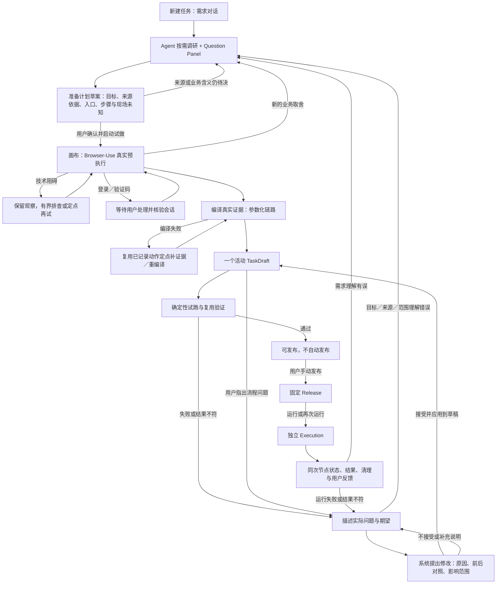

# 需求到复跑：能力对齐与最小闭环缺口

初审：2026-09-22；流程修订：2026-09-24；草案边界修订：2026-09-25。状态：**历史能力审计与待实施架构并存；各项现状以 PROGRESS 为准。** 第 1、2、5–8 节的核验列和 G 编号包含历史快照，不得把旧“独立预执行方案生成”当成当前目标架构。

**2026-09-27 范围更新：** 完整智能修复已登记为 D1 删除任务，代码尚未删除。下文 §3 调整分支、§4.1–4.5 的模型建议/差异/接受拒绝交互、旧 G12、§6.1 调整验收和 §8 第 4/5 组相关修复交付要求统一后置，不再作为当前主线关闭条件；这里的旧 G 编号不是新开发方案的 G0–G6。三个任务情境保留为真实界面事实，无链路失败仍在原阶段处理。唯一草稿、不可变 Release、运行快照/输入绑定、幂等、原失败记录和同次资源清理继续有效。当前顺序及 D1–D6 的已定/待决边界只见[开发方案 §2.3](INFRASTRUCTURE_MAINLINE_DEVELOPMENT_PLAN_20260927.md#23-功能减法登记与同类功能评估)。

目标：保留 AI Connect 等现有能力，按 [ADR 0011](../adr/0011-interview-produces-preparation-draft.md) 实现「新建任务 → Skill 驱动的按需调研与唯一准备计划草案确认 → Browser-Use 预执行 → 链路草稿 → 复跑验证 → 手动发布 → 再次运行」。减法删重复业务规划入口，同时保留来源证据、失败恢复和用户决策。**调整流程是出问题时才走的分支；正常验证通过后直接由用户发布。**

本文补充 [WORKBENCH_SIMPLIFICATION](WORKBENCH_SIMPLIFICATION.md)，不恢复独立 Plan/Results/repair/preset。具体任务的 URL、品牌、字段和数量属于任务数据，不写入平台规则。

## 1. 结论与证据分级

1. **AI Connect 接入仍在。** 账号/模型绑定、Authoring、Question、共享 Timeline/Composer 并未整体被删；搜索 extension 也能实际注册。缺口在若干宿主适配、规则和 UI 接线上。
2. **搜索有三层，不能混说。** 包能注册工具已核验；联网搜索成功尚未核验；需求 Agent 围绕任务自主调研并形成可见依据的完整路径尚未通过。
3. **最新任务失败在计划形成。** 两次模型 JSON 均可解析，但结果所有权合同不合法；没有启动 Browser-Use。没有证据证明该合同问题由此次 UI 删除直接引入。
4. **减法确实留下主线断点。** 无图时处理面板没有挂载、失败后生成入口消失、快照序号可能回退、诊断没有准备失败详情。它们足以使用户无法继续。
5. **此前完成结论范围过大。** 旧链编辑、发布、运行和重启证据仍保留，但不覆盖全新需求，也不证明无需刷新的一次连续生命周期。

标记含义：**实测**＝正式页面/API/只读数据库或实际安装包探针；**代码确认**＝当前实现可直接推出；**未验**＝没有产品级证据。离线合成事件、静态源码和历史结果不能冒充新任务成功。

## 2. 谁负责什么

| 层 | 沿用的能力所有者 | B-A-T 负责的接线 | 当前核验 |
| --- | --- | --- | --- |
| 模型连接 | AI Connect | 当前选择、用途和任务审计 | 实际公共模块可导入，主路径调用 binding / generateObject |
| 需求 Agent | Pi AgentSession | 传入访谈 skill、完整对话和受限工具 | 固定包支持 session、extensionTools、ResourceLoader 和工具事件 |
| 问题与草案协议 | AI Connect Authoring / Common Question | 业务草案指令、用户决定与版本持久化 | 主路径仍用公共 parser、Question projector 和回复协议 |
| 搜索 | pi-web-access extension；现有只读后备 | 限制工具范围、引用核验、持久化业务决定 | 实际注册成功；联网调用未验 |
| 对话 UI | ai-connect-react InteractiveTimeline / Composer | 把 Pi extension 事件投影到公共 hook；领域草案入口 | 主组件已复用，但搜索 hook adapter 缺失 |
| 准备计划草案 | 访谈 Skill + AI Connect Authoring / Question | 对话内形成并确认业务步骤、来源依据、试做入口和停止点；B-A-T 只做受校验的内部合同投影 | 当前实现仍另生成 TaskPlan，属于待迁移差距；旧计划失败事实保留在第 7 节 |
| 真实预执行 | Browser-Use Agent / Tools | 固定已确认草案、唯一浏览器所有权、证据采集 | 2026-09-25 新任务已完成真实试做；入口来源仍有缺口 |
| 链路编译 | 现有 workflow-use compiler + B-A-T materializer | 参数绑定、完整动作覆盖、TaskChain 与展示 | 2026-09-25 新任务首编译 `gaps=[]`，不消除错误入口 |
| 确定性执行 | LangGraph / TaskChainRuntime / QuickJS | 精确版本、预算、恢复、结果和模型审计 | 新任务已有零模型技术复跑；可见播放未验 |
| 草稿与发布 | 现有 SQLite / TaskDraft / Release / Execution | 唯一活动链路草稿、用户手动发布、同次运行投影 | 新任务已有手动发布与历史运行；新草案合一未实现 |

不得为上述缺口重建聊天组件、Agent loop、搜索供应商分支、图调度器或第二套产品状态。

## 3. 两个前置阶段的输入、产物和可见 UI

| 阶段 | 做什么 | 必须交给下一阶段什么 | UI 只显示什么 |
| --- | --- | --- | --- |
| **需求对话、业务预调研与准备计划草案** | Skill 根据完整对话决定何时搜索、调查什么、向用户确认什么；在同一对话中修订并确认可直接交给 B-U 的草案 | 一个已确认草案版本，含目标、来源引用、试做入口、步骤依赖、动态输入、完成标准和现场未知 | 对话、真实搜索活动、简短依据、Question Panel、准备计划草案及确认 |
| **Browser-Use 真实预执行** | 用户启动后，从该草案授权的入口和范围走代表路径，观察真实页面并记录动作、读取和结果；技术阻碍定点处理，新业务歧义返回对话 | 不可变来源证据：精确草案引用、动作与观察、实际结果、可参数化输入、动态输出及失败事实 | 当前业务步骤/动作；失败时显示已经观察／尝试的内容与下一步；登录、验证码或业务选择才展开人工处理；完成后给代表结果摘要 |

需求调研不以「每次都搜索」为固定动作。品牌别名、来源身份、术语和候选范围由 Skill 按任务需要调查；当 B-U 需要 URL 入口而本轮没有可追溯的用户提供资料或搜索结果时，不得把模型记忆中的网址当成已确认入口。搜索次数不能替代需求充分性判断；只读搜索不证明页面控件、访问权限或操作路线已验证。

同一草案确认后，用户通过工作台启动浏览器试做；宿主的合同投影不能构成第二次业务规划或第二份待确认计划。真实副作用或新业务取舍仍按已有授权边界处理。草案的业务步骤不是已经观察到的可执行节点图。

## 4. 全链路与 UI 对应

以下是恢复后的目标流程，不是当前已通过的流程；当前断点见第 5 节。

**四个不同的“跑通”不能混为一谈：**Browser-Use 走通代表路径，只证明这一次做到了；把真实动作编成链路，才有草稿；草稿在不重新让模型找路的条件下试跑／换输入成功，才证明可复用；用户手动发布后，每次正式运行才有独立结果。Browser-Use 失败时没有可编辑链路。编译失败时也可能已有代表执行结果，却仍没有可复跑链路。



```text
需求对话                             链路画布
┌────────────────────────┐          ┌────────────────────────────────┐
│ 对话 / 真实搜索活动      │          │ 草稿/已发布  当前阶段   主操作   │
│ 调研结论 [查看依据]      │   →      ├────────────────────────────────┤
│ 当前 Question           │          │ 未有图：当前步骤 + 必要处理     │
│ 需求草案 [确认需求]      │          │ 已有图：阶段 → 阶段 → 阶段      │
│ 确认后 [生成链路草稿]    │          │                  单一按需详情区│
└────────────────────────┘          └────────────────────────────────┘
```

| 当下事实 | 画布主操作/反馈 | 对应逻辑与结果 |
| --- | --- | --- |
| 准备计划草案已确认，尚未生成链路 | 启动代表试做；点击立即有提交反馈 | 创建准备 job；校验同一草案及来源引用，随后交 B-U、编译和验证 |
| 草案缺少来源或业务决定 | 在需求对话显示待决事实和可继续操作 | 保留真实搜索候选、引用及草案修订；此时不启动 B-U，也没有链路 |
| Browser-Use 试做中或遇阻 | 展示实际观察、已尝试的方式、当前动作；确有需要时展开处理区 | 系统先在已有授权内有界排查；登录、验证码或新的业务取舍交给用户，此时仍没有可编辑链路 |
| 代表执行已完成，编译未完成 | 展示已得到的代表结果和「链路尚未生成」；按需看缺少什么证据 | 优先复用已记录动作重编译，必要时定点补观察；不能把一次成功当作可复跑发布版本 |
| 草稿存在 | 说明要调整什么 / 查看修改 / 试跑 | 系统先提议，用户接受后才改该草稿；试跑冻结该 revision/checksum，修改后旧验证失效 |
| 草稿验证满足 | 发布；没有问题则无须进入调整流程 | 仅用户显式发布产生 Release；不自动发布 |
| 已发布 | 运行 / 再次运行 | 固定同一 Release，新建 Execution；普通节点零模型 |
| 运行中/完成/失败 | 同次节点状态；结果或失败处理按需打开 | 不拼接其他运行事件；用户验收与技术完成分别保存 |
| 清理未确认 | 清理资源 | 保留业务输出和 TaskRun 结论；处理同一 Execution 所属资源 |
| 历史 | 更多 → 历史 → 查看所选运行 | 读取该次结果和事件，不能仅列摘要后无查看入口 |

准备、方案、结果与修复保留行为和证据，不增加独立页面。原始 JSON、prompt、digest、内部 ID 和批量历史留在按需诊断；错误阶段、当前动作、业务结果和可恢复操作属于主线信息。

### 4.1 画布定位：可以要求调整，不要求用户编程

普通用户通过「看流程、运行、定位问题、说明期望、确认修改」使用画布，不以手工增删节点、接线、写代码为完成任务的前提。完整手工链路编辑器后置，不是本轮最小闭环的交付条件；已有底层编辑与校验能力继续作为受控修改的基础，不因入口调整而直接删除。

**还没有链路时，不出现「修改节点」。** 计划校验失败保留计划候选和合同问题，在计划层纠正；Browser-Use 试做受阻时保留现场观察，系统先自行判断可行的下一步，只在登录、访问限制、新业务歧义或需要扩大授权范围时要求用户处理；试做成功但编译失败时优先复用真实记录补齐链路。用户可随时补充业务期望或指出偏差，系统判断是继续试做还是返回需求对话，不能把技术排错转嫁给用户。任何有界恢复都应留下尝试次数、结果和停止原因，不无限重试。

对应的[三情境可点击原型](../../work/prototypes/repair-flow-v1.html)展示了「尚无链路」「草稿试跑失败」「已发布后失败」三种状态；[无链路截图](../../work/prototypes/repair-flow-v1.png)、[草稿截图](../../work/prototypes/repair-flow-draft.png)、[已发布截图](../../work/prototypes/repair-flow-release.png)只说明交互，不是视觉实现稿、产品实现或运行证据。原型的独立配色和控件不得照搬到正式系统。

运行参数和链路修改分开：修改已有参数（如本次关键词或数量）只影响本次运行；新增判断、改变操作路线或输出处理才进入草稿调整。若改变的是已确认的目标、来源、范围或结果含义，返回需求对话，不由调整模型自行决定。

正常完成但结果不满意，同样可以要求调整，不限于报错节点。用户不知道是哪一步出错时，可以从「本次结果 → 调整链路」描述问题；系统先结合运行证据定位，不能要求用户找内部节点 ID。

### 4.2 后置历史设计：从指出问题到发布新版

正常路径是「草稿验证通过 → 用户手动发布 → 日常复跑」；不强迫用户每次进入调整。只有草稿试跑失败、发布后运行失败或结果虽技术完成但不符合需求时，才走：**选中步骤或结果 → 说明问题 → 系统提出修改 → 查看并确认 → 试跑验证 → 手动发布新版。** 初次草稿通过后点击的是首次发布，不叫发布新版。

| 环节 | 用户在 UI 中做什么 | 系统负责什么／交给下一步什么 |
| --- | --- | --- |
| 1. 指出问题 | 选中业务步骤或具体动作，右侧点「调整这一步」；也可从结果点「调整链路」 | 自动带入所选步骤、本次输入与实际结果、错误证据、对应需求和准确链路版本。选择只提供定位线索，不代表允许修改整条链 |
| 2. 说明期望 | 右侧输入「哪里不对、希望怎样」，点「提出修改」；无须填写代码、选择器或 JSON | 复用现有 AI Connect / Pi 对话、工具事件和问题组件。确有歧义时在同一区域追问；已知事实不重复问，不新增独立修复聊天页 |
| 3. 提出修改 | 看到「正在分析／正在生成修改」，可取消；完成后查看建议 | 给出有证据的问题原因或明确的不确定性、具体修改及影响范围、需要怎样验证。此时不覆盖活动草稿、不改已发布内容、不启动试跑 |
| 4. 查看并确认 | 右侧看到「原来怎样 → 改成怎样」「为什么改」「还影响哪些步骤」；可点「接受并应用」、补充说明或「不采用」 | 画布仅高亮受影响部分；差异来自实际候选修改，不能只用模型口头摘要。接受后原子应用到唯一草稿并使旧验证失效；不接受则链路内容不变 |
| 5. 试跑验证 | 应用后显示「待验证」，主操作为「试跑修改后的链路」；确认本次输入和必要风险 | 使用冻结的草稿内容创建新的试跑，先做合同检查，再用既有执行器验证真实结果和受影响的前后步骤。局部检查不能代替发布所需的整链验证 |
| 6. 发布新版 | 看到实际试跑结果和验证结论；通过后点「发布新版」，确认修改摘要 | 精确冻结用户确认且已验证的草稿，新增不可变发布版本。修改、接受建议、试跑均不自动发布；旧版本和原失败运行不改写 |

一次建议作为一个完整修改集合接受，暂不做逐条勾选任意组合；用户只接受其中一部分时，补充说明后重新生成一致的建议并重新确认，避免切断依赖。若发现必须扩大修改范围，必须在确认前列出涉及步骤和理由；不能借「调整这一步」暗中重写全链。

### 4.3 同一画布中的呈现

顶部保持「尚无链路／工作草稿／已发布版本、当前状态、当前主操作」。中间在链路形成前展示方案或真实试做进展，形成后才展示同一张流程图；右侧保持一个按需上下文区。业务步骤与技术动作仍在同一图内折叠展开。

```text
选中步骤            说明问题             查看修改              应用后
右侧：动作与结果 → 输入期望、提出修改 → 前后对照、影响范围 → 待验证、试跑
                                        接受／不采用          ↓
                                                     实际结果 → 发布新版
```

- 在「说明问题」「查看修改」「试跑结果」间切换的是同一右侧区域，不叠多个抽屉，不新增修复 Tab；关闭区域不等于取消后台工作或丢弃建议，取消有明确按钮。
- 建议预览只作标记或按需对照，不能把尚未接受的修改冒充当前可运行链路；应用后的新图也不能沿用旧运行的成功颜色。
- 用户点击提出修改、接受、试跑或发布时立即得到提交中／已接受／失败反馈；需要输入、取消或重试的入口不能因尚无完整图而消失。尚未形成链路的准备错误沿用准备恢复入口，不能伪造可选节点。
- 失败区域先说「哪里失败、已经改了什么／什么没改、下一步能做什么」。技术原文折叠；不只显示“请重试”，也不把普通用户送到节点表单自行排错。

### 4.4 草稿、发布版本和运行证据怎样衔接

1. **已有草稿优先保护。** 在当前草稿上调整就以其准确 revision/checksum 为基线；从已发布版本进入且没有草稿时，建议绑定该版本，接受时创建唯一草稿。若另有草稿，先说明差异，让用户选择继续现有草稿或取消；替换／放弃既有草稿必须单独明确确认，不创建第二份活动草稿。
2. **建议不是第五种产品资产。** 修改请求及待确认建议归属本任务的调整审计，保存基线、用户说明、候选修改、差异、确认／拒绝事实、验证引用和发布关联。复用现有任务审计与草稿机制，不建立独立 repair/preset 生命周期、第二套可执行图或用户管理的“建议版本库”。刷新能恢复待确认建议；无法恢复的处理中请求明确显示中断，不静默重跑模型。
3. **确认不能错位。** 接受建议时重新核验基线和草稿并发令牌；内容已变化则提示建议过期，基于新内容重新生成／确认。重复点击或网络重试不能重复应用、重复试跑或重复发布。用户取消后迟到的模型结果不能自动写入草稿。
4. **旧运行不被修成新运行。** 修改后的试跑是新的一次执行；原运行继续保留其版本、错误与结果。正在运行的旧发布版本不热替换；资源清理未确认时，先处理原执行拥有的资源，再启动需要浏览器的新试跑。普通复跑不触发模型修复。
5. **发布版本和运行历史分开。** 顶部一个发布版本入口显示「已发布 V3」或「工作草稿 · 基于 V3」；按需列出发布时间和修改摘要。接受修改只更新草稿，发布才生成 V4。查看／运行旧版须明确标注该版；恢复旧内容也经草稿、验证和新发布，不覆盖历史。运行历史始终标明实际使用的发布版本。

### 4.5 失败、返回与权限边界

| 情况 | 必须提供的下一步 | 不允许的行为 |
| --- | --- | --- |
| 说明不清、证据不足 | 追问一个影响修改的问题，或说明缺什么观察；保留用户输入 | 猜测目标／来源，编造原因或已验证结论 |
| 原证据不足以生成可信修改，需要再次访问页面 | 说明需要观察什么、已有证据为何不够；在已授权范围内执行定点观察，新增风险或超出范围时再请用户决定 | 提出修改即静默重开整项任务；无改动重复探索 |
| 建议生成失败／用户取消／拒绝 | 保留原链路；可补充说明、修正原因后重试或返回查看 | 自动应用部分修改、自动无限纠正或覆盖原失败证据 |
| 接受时基线已变化／应用校验失败 | 保留原草稿，展示过期或校验原因，重新生成建议 | 静默合并、写入半份计划／链路／展示，放宽合同 |
| 试跑失败或用户仍不满意 | 展示本次结果和失败位置，可继续说明问题或返回查看草稿；未发布版本仍不变 | 自动发布、把原运行改成成功、暗中调用模型修复 |
| 其实是需求理解错误／只是资源清理问题 | 前者携带反馈和相关运行返回需求对话；后者进入该次运行的清理处理 | 把两者都当作链路技术修改 |

调整模型只在用户请求提出／重新提出修改等明确的创作动作中调用，并单独计账。试跑和日常复跑沿用普通节点零模型的边界，只有显式 llm 节点例外。接受建议不是浏览器操作授权；试跑／探索按各自已说明的范围和风险启动，需要登录或验证码由用户处理。

本节明确交互与所有权，不宣称实现已经接通，也不授权本轮修改 prompt、替换依赖或删除现有关键能力。实施前核验共享包和现有修改原语的实际能力，完成最小契约设计与复用记录。

### 4.6 正式实现的主题与组件约束

原型只规定「何时出现什么、用户如何继续」；正式 UI 必须融入当前工作台，不能把原型当成另一套视觉规范。现有 [Theme 入口](../../apps/workbench/src/main.tsx)支持暗／亮主题，使用 amber 强调色、sand 中性色、small 圆角与 95% 缩放；[语义色与间距](../../apps/workbench/src/styles.css)及[链路画布样式](../../apps/workbench/src/chain-workbench.css)是新增状态与布局的基线。

- 操作、状态、提示与对话框沿用现有 Radix Themes 组件及其变体；需求对话沿用 AI Connect 共享对话组件；链路图沿用现有 React Flow 阶段／动作节点，不再造一套按钮、面板、对话或图节点。
- 「说明问题 → 修改建议 → 前后对照 → 试跑结果」复用画布现有单一右侧上下文区；正常路径与异常路径保持同一套字体、间距、圆角、状态语义和即时操作反馈。新增视觉规则优先扩展集中 token／变体，不在页面里散落原型色值或独立主题。
- 深色默认主题和亮色切换都必须可读；状态不能只靠颜色表达，键盘焦点和窄窗口／全屏画布布局不得退化。正式页面分别检查两种主题下的需求对话、无链路进展、草稿试跑、已发布运行和调整侧栏，截图与交互检查才是视觉验收证据，原型截图不能替代。

## 5. 已确认缺口与修复顺序

| 编号/优先级 | 已确认事实 | 最小修复方向 | 退出证据 |
| --- | --- | --- | --- |
| G1 / P0 | `interviewTimelineProjection.tsx` 调公共 `projectAIInvocationTimeline` 未传 `projectExtension`；实际包离线探针对比有/无 adapter，只有接 adapter 才生成搜索 hook | 用公共扩展投影接 Pi 工具事件，并绑定所属消息/turn | 正式需求对话发生一次真实搜索，开始/结束/失败及引用可见；刷新可重建 |
| G2 / P0 | `coordinator.ts` 对任意搜索强制要求 `sourceResolution`；来源提交又用宿主正文替换原 parts | 区分业务调研和来源决策；保留有依据的调研正文；只有真实业务选择才出 Question | 一次非来源身份调研可正常形成解释/业务问题；一次来源选择可正确确认 |
| G3 / P0 | 当前 skill / protocol / 后备工具说明偏向来源歧义；没有搜索也允许成稿。**这不等于所有无搜索草案都非法** | 按用户本轮明确的任务驱动调研职责对齐行为规则；禁止站点词表和强制 URL 门 | Agent 基于需求确定调研范围；必要事实可追溯；不伪造引用。既有「不改 prompt」约束未被此次审计擅自撤销 |
| G4 / P0 | 最新计划的数组整体 producer 与第 0 项字段 producer 重叠；纠正后只剩第 0 项，必需数组无整体 owner | 补准确的路径/ownership 诊断和候选恢复；复用已有结构化纠正，不放宽校验、不猜业务归属 | 当前失败候选离线复现准确问题；一次受控计划级纠正形成合法方案；没有无理由重开 B-U |
| G5 / P0 | LiveChain 无图分支不挂载 WorkbenchContext；正式页面点击生成状态后面板仍不存在 | 空态和有图态共用一个可挂载上下文区 | 从全新需求进入代表输入或失败处理，无刷新即可继续 |
| G6 / P0 | 有 failed activity 时「生成」隐藏；界面仍说请重试；侧栏把任何 activity 显示为 planning | 失败/中断有明确恢复入口与正确状态；根据失败阶段重用可用产物 | 最新任务不再困在死路；重试不会丢原失败证据或重复创建活动工作 |
| G7 / P0 | `stateSequence = task + draft + release + execution + activity`；对象替换/消失使总和回退，客户端拒绝较小快照 | 使用真正单调的服务端变更序列；保持乱序保护 | 新 job 替旧 job、完成生成、编辑、发布、第二次运行均不刷新推进；重启仍保持 |
| G8 / P0 | diagnostics 只返回 descriptors/legacy；准备失败的准确原因未交给 UI；phase 压成 generating | 按需诊断绑定当前 job 的实际失败层和合同问题；薄状态派生真实阶段 | 用户看得到失败在哪、原因是什么、能做什么；主界面不回灌整份审计 |
| G9 / P1 | Pi 搜索结果解析只接受独占一行裸 URL；Markdown 链接离线 probe 得 0 candidates | 按真实 extension 返回合同适配引用，缺证据就如实失败 | 实际 provider 输出可归一引用；不使用关键词/排名替模型选来源 |
| G10 / P1 | 历史 UI 当前只列摘要，缺少选中某次 execution 读取完整结果/事件的动作 | 复用按需读取与同次 execution 投影 | 已完成、失败的历史运行可独立查看，当前图不混入历史事件 |
| G11 / 验收门 | 旧减法脚本要求已有 draft，支持多处 checkpoint；未覆盖 fresh task 和一口气推进 | 增补新建任务正式路径，保留旧局部证据但纠正完成范围 | 见下一节五道门，全部取得正式页面/API/持久化证据 |
| G12 / 必须补齐的交互门 | 原文仅规定定位草稿、试跑和发布，未定义自然语言反馈、修改建议、差异确认及拒绝；不是新增的代码实测结论 | 按 4.1–4.5 补齐主交互，替代普通用户手工编排的默认路径；复用共享对话和唯一草稿 | 正式 UI 完成说明问题→建议→查看差异→接受→试跑→发布；另覆盖拒绝、取消、过期、验证失败和需求回流，见 6.1 |
| G13 / 准备恢复门 | 旧文档把「调整」写在草稿之后，遗漏了计划失败、Browser-Use 受阻和试做成功但编译失败时尚无链路的处理；这三类不是同一种链路修复 | 将候选、已观察动作与当前失败层分开保存并定点恢复；无图时给真实进展和处理入口；在已授权范围内先自主排查 | 计划问题停在计划层；Browser-Use 受阻保留现场并有界继续／准确停止；编译失败复用已记录动作；没有链路时不显示节点编辑，不无故重跑整项 |
| G14 / 可复跑验证门 | Browser-Use 代表执行成功，只证明一次任务完成；旧正式验收未证明全新任务从成功试做到可复跑 | 明确「代表结果／已编成链路／已验证可复跑／已发布」四个事实和 UI 状态；复用现有 sample、独立试跑与模型审计 | 新任务链路在固定执行器上试跑；有可变输入时换输入仍按新值出结果；失败不开放发布，正常通过可由用户直接发布，无强制修改步骤 |

另有待核项：`web_search` 的可选 summary workflow、provider 结果格式和联网凭据路径是否都符合受限只读边界。工具名白名单不足以证明参数分支都符合要求；未核验前不能写成已支持或已违规。

实施顺序按第 8 节的五组工作包执行。先解决最新任务的计划阻断和无图死路，再把需求调研、真实试做、编译、验证、发布与运行接成连续正常路径；随后验收已有链路出问题时的调整分支。G1–G3、G9 的调研能力对齐与准备恢复并行推进，不能把搜索缺口误当作本次计划错误的直接原因。完整手工链路编辑器不在本轮退出条件中。真实产品浏览器只允许一个 owner。

## 6. 最小闭环的五道退出门

1. **从新建任务开始。** 正式 UI 完成任务驱动的必要调研、真实引用、业务 Question、草案和确认；不手填内部 JSON，不往数据库注入计划或链路。
2. **准备可推进也可恢复。** 同一页面从有效方案到真实预执行、不可变证据、编译和 TaskDraft；方案／Browser-Use／编译三类失败分别有可见诊断和定点恢复。无链路时不出现节点编辑；登录、访问限制和新业务选择正确停下。每次失败先诊断，禁止无改动重复整跑。
3. **试做成功不代替复跑验证。** 展示代表执行结果，同时准确说明有没有编成链路、链路能否在固定执行器中复跑；有可变输入时验证不同输入。保存／试跑时 Release 数量不变，修改使旧验证失效；用户发布后只新增一个冻结版本，试跑保留 execution-owned snapshot。
4. **同链再次运行。** 正式页面运行两次，各自独立 execution，图/结果/事件归属一致；普通复跑模型调用为 0，显式 llm 节点另审计；清理事实独立保留。
5. **不中断 UI 与重启复核。** 不刷新走完主线；再重启服务核对需求、草稿或发布、结果、历史及资源所有权。正式页面在暗／亮主题下复核主线与调整侧栏的组件、状态和布局一致性。当前 Windows 重新验收；macOS 仍无本轮真机证据。

简单真实任务用于验证通用最小路径；不能冒充京东洗碗机任务已完成。用户最新任务必须保留原有需求与失败事实，单独报告是否恢复，以及是否遇到真实登录/访问限制。

### 6.1 自然语言调整的退出证据（G12，当前未验）

1. **不用手工编辑也能完成。** 经正式 UI 从步骤及结果入口提出问题，自动携带正确版本和同次运行证据；建议的前后对照与实际候选内容一致，用户未接受前草稿内容／发布记录不变。
2. **确认与取消真实有效。** 接受只应用一次到唯一草稿并使旧验证失效；拒绝、取消及迟到响应不改链。已有草稿不被覆盖，过期建议不能应用；刷新后用户说明、待确认建议和接受事实可恢复。
3. **验证结果可追溯。** 新试跑引用接受后的精确草稿，失败不能发布；继续调整再次经过差异确认。原失败执行保持不变，普通试跑的模型调用为 0，显式 llm 节点单列。
4. **发布与旧版互不污染。** 提出、接受、试跑均不新增发布；显式发布只新增一次，修改摘要、基线、验证和新版本关联一致。新版本能正式复跑，旧版及其历史运行仍能按需查看；重启后关联保持。
5. **分流和副作用不越界。** 需求误解返回对话；清理异常只处理原资源；新观察在既有授权范围内可定点继续，超出范围或产生新的业务风险才请用户决定。验收同时包含运行报错与技术完成但结果不满意的入口，不靠注入草稿、假事件或手工节点修改绕过主交互。

## 7. 2026-09-22 审计快照与可重复证据

- checkout：`master@7d59036332a66de8991744659d2317da126c6123`，唯一 worktree；既有大量 dirty 保留。服务 `/api/health` 返回本 checkout，PID `21392`。未停止用户服务。
- 数据库：`data/workbench.sqlite`，`user_version=17`，WAL；只读核对 8 个 Release、43 个 Execution、22 个 candidate snapshot、0 个活动 TaskDraft。最新任务对应数量均为 0。
- 最新任务：`695bc458-95df-410c-8cd0-e540035d98c8`；准备 `816f32af-8790-4e06-89f2-8b552bf856eb`，`failed/forming_plan`、`browserRunId=null`。需求确认 2026-09-22 17:01:53 +08，准备失败 17:03:08 +08。
- 该任务对话的搜索/工具事件为 0、`sourceResolutions=[]`、`confirmationFacts.sources=[]`。只能证明本次没记录到搜索，不能推出搜索工具不存在；草案的现场可行性未验证。
- 计划审计重组的两份合法 JSON 用当前 `semanticPlanSchema.safeParse` 离线复现：首份 `result_spec_path_conflict` / `result_spec_optional_field_edge_case_required`，第二份 `result_spec_required_path_missing`。
- 固定包：AI Connect `0.3.2-e61cfe91`、React `0.3.2-15d6e5f0`、Pi AgentSession `0.1.0-52e0e9c6`；vendor tgz 的 SHA256 与 release.json 一致；安装包公共模块导入成功。这不等于所有安装文件与归档逐字一致。
- 实际 ResourceLoader 离线注册：1 个 extension、0 个 errors，工具 `web_search/source_check/fetch_content/get_search_content`；BAT 仅激活 `web_search`，另有两个宿主来源工具。未调用联网搜索或模型。
- 公共包离线事件 probe：bridge 把合成的 tool started/completed 转为 AIEvent；缺 adapter 时无搜索 hook，传公共 adapter 后出现搜索 hook。属于共享能力/适配验证，不是真实搜索证据。
- 正式 UI 只读证据：[ui-audit.json](../../work/capability-alignment-20260922/ui-audit.json)、[需求对话截图](../../work/capability-alignment-20260922/01-interview.png)、[失败画布截图](../../work/capability-alignment-20260922/02-failed-canvas.png)、[点击状态后截图](../../work/capability-alignment-20260922/03-clicked-preparation.png)。面板不存在，可见按钮仅生成失败状态和更多操作。验收 Chrome 使用独立临时 Profile，finally 关闭。

主要代码证据：`apps/api/src/ai/model.ts`、`interview/coordinator.ts`、`interview/source-resolution.ts`、`interview/protocol.ts`；`apps/workbench/src/ChatTimeline.tsx`、`interviewTimelineProjection.tsx`、`LiveChain.tsx`、`WorkbenchContext.tsx`、`taskChainConnection.ts`；`apps/api/src/task-chain/authoring.ts`、`preparation.ts`、`workspace-projection.ts`、`product.ts`；`packages/contracts/src/task-chain/plan.ts`。

以上审计事实均来自 2026-09-22 的快照。2026-09-24 只补充了交互原型与恢复设计；没有据此修改产品实现、prompt、用户任务或发布数据，也没有发起模型纠正、Browser-Use 探索或正式复跑。**最小闭环仍未通过，不能关单或以旧验收记录宣称已经恢复。**

## 8. 要做什么，完成后能达到什么效果

下表是实施清单，不是已完成记录。改动必须沿当前 checkout 保留用户已有 dirty work，不创建 worktree，不 reset／clean／commit／push；实施前复核服务、库和最新任务状态。每组只做覆盖其真实不变量的最小验证。先把正常路径跑通，再处理已有链路的调整分支。

| 顺序 | 要做的事 | 完成后用户能得到什么 | 必须看到的退出证据 |
| --- | --- | --- | --- |
| **1. 解开当前任务的死路** | 修 G4–G8：准确显示计划结果所有权问题并保留两份失败候选；在计划层继续纠正；无链路时可展开失败处理；失败后有可用恢复操作；修工作区快照序号回退和阶段文字 | 最新已确认任务不会卡在「生成未完成」又无处可点，用户能知道卡在哪、如何继续 | 当前任务从原候选出发形成合法方案或明确停在可处理错误；没有假链路、无刷新状态推进，不无故启动 Browser-Use |
| **2. 接通需求到草稿** | 修 G1–G3、G9、G13：复用 AI Connect／Pi 搜索及事件能力；业务调研与来源选择分开；方案通过后按已授权范围真实试做；技术阻碍有界排查；试做成功再编译，失败优先复用记录定点补证据；形成唯一草稿 | 用户能看到必要搜索、方案、真实试做和链路生成的实际阶段；试做未通时不必改不存在的节点 | 一项从正式页面新建的任务完成真实试做并产生一份草稿；另覆盖计划、试做、编译的失败恢复，不强制每项任务都搜索或补 URL |
| **3. 证明链路能反复运行** | 修／复验 G10、G14：用现有执行器做草稿试跑；有可变输入时检查不同输入；失败禁止发布；正常通过由用户手动发布；顶部显示当前发布版本，旧版按需查看；画布运行同次状态、结果与资源清理 | 第一次浏览器做成的任务，能在以后按固定链路再做；用户清楚当前用哪一版，历史结果能找回 | 新任务试跑、发布、两次独立正式运行均通过正式入口；有可变输入时换输入成功；普通节点模型调用为 0，发布前后事实和历史正确 |
| **4. 补齐出错时的调整** | 实现 G12：已有链路时从步骤或结果说明问题；系统基于准确运行证据提出有差异的修改；用户接受后写唯一草稿，试跑通过才手动发布新版；需求误解返回对话，清理问题走同次资源处理 | 用户能用业务语言纠正跑错的流程，不必会拖节点；正常运行完全不经过这一步 | 正式页面覆盖提出／接受／拒绝／过期／验证失败／新版发布；旧发布和原运行保持不变，重启可恢复待确认状态 |
| **5. 正式关闭验收门** | 修 G11 并复核全部门：从新建需求不注入计划／链路、不中途刷新走到发布与再次运行；另验无图失败恢复和调整分支；核对 API、SQLite、重启和唯一浏览器会话 | 用户真正拿到一条可复跑、可恢复、可修订且有历史的链路，而不是只看见旧链演示通过 | 每道门都有正式 UI＋API＋持久化证据；Windows 本轮重新验收，macOS 待真实设备；未通过的门明确写未通过 |

实施边界：沿用现有 AI Connect、Pi、Browser-Use、编译器、LangGraph、React Flow 与 SQLite 的能力。正式界面沿用当前 Radix Theme、语义 token、共享组件与链路画布样式，原型仅用于交互对齐。产品只保留需求对话和同一张链路画布、一个活动草稿、显式发布、每次独立执行及按需历史；不恢复独立 Plan／Results／repair／preset，不新增网站或任务特例。修改关键依赖或访谈 prompt／skill 前先按项目复用规则核对必要性和现有约束，不能靠放宽合同、盲目重跑或增加页面掩盖断点。
