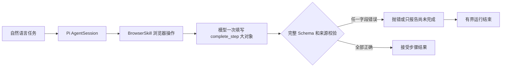
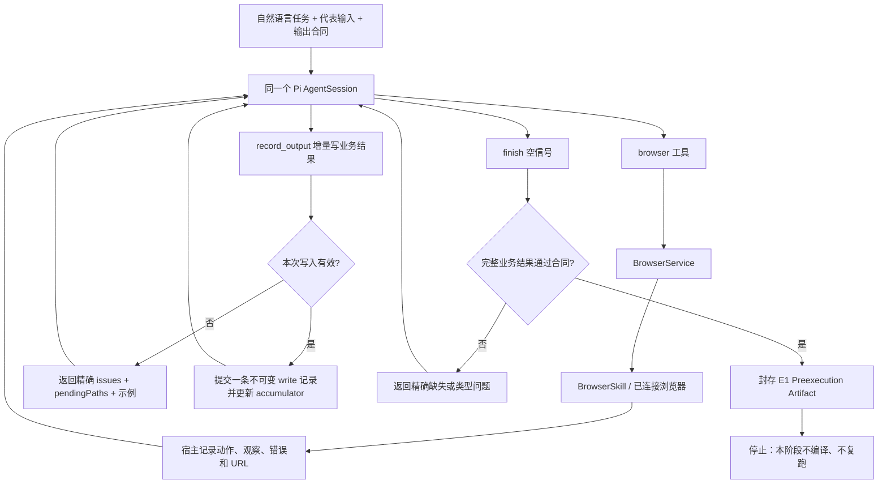

# 临时预执行 Agent Loop 验证方案

日期：2026-09-15
状态：临时验证基准；A/B 已通过，真实证据见 [PROGRESS](PROGRESS.md)
目标：先证明 `AI Connect -> Pi AgentSession -> BrowserSkill -> 有效业务结果` 可以稳定闭环；本阶段不生成链路节点、不复跑链路，也不冻结最终技术栈。

## 1. 先回答当前最主要的问题

当前失败不表示 Pi Agent 或 BrowserSkill 无法控制浏览器。真实运行已经发生 19 次浏览器工具调用，说明模型、AI Connect、Pi 工具桥和 BrowserSkill 的基本调用链已经工作。失败发生在浏览器操作之后：宿主要求模型一次性调用 `complete_step`，同时填写步骤标识、代表输入、完整结果、逐字段 provenance、聚合语义等大量技术字段；任何字段不合规都会抛错，而宿主只返回“预执行尚未完成”这一类粗粒度反馈。模型无法知道具体错在哪，也没有稳定的同会话修复协议。

当前链路等价于：



这把三类职责混给了模型：完成业务任务、整理业务输出、生成平台内部编译证据。临时验证先切开这三件事，只验第一件和第二件。

## 2. Product Alignment

```text
Product Alignment:
- natural-language task: 用一个代表输入完成一次真实、自然语言驱动的浏览器业务任务
- reusable chain boundary: 保留首次成功执行的类型化历史；链路编译延后，不在本阶段宣称完成
- runtime inputs: 已确认的自然语言目标、起始地址或代表输入、动态输出合同、现有浏览器和模型预算
- dynamic task outputs: 通过业务 Schema 校验的结果，以及宿主自动记录的类型化执行历史
- generic platform capability used: AI Connect、Pi AgentSession、BrowserSkill、BrowserService、Zod、现有运行审计与持久化
- replay model calls: N/A；临时验证停在首次预执行 E1，不进入复跑
- site/task-specific code added: no
```

## 3. 选型结论

不整体切换到 browser-use 或 workflow-use，也不引入 Python sidecar。保留当前 TypeScript 技术栈和产品边界，只 clean-room 复刻它们已经验证过的运行机制：

1. Agent 在同一会话内持续操作工具；一次可修复错误不会终止整个任务。
2. 工具错误以结构化结果返回 Agent，明确指出路径、期望类型、实际值和下一步可用示例。
3. 业务结果增量写入宿主持有的 accumulator，模型不在最后一次调用中重复提交全部历史和大结果。
4. `finish` 只表示“请宿主验收”；宿主负责最终 Schema 校验，缺什么就把精确问题返回同一 AgentSession。
5. 浏览器动作、页面观察、错误、结果写入和模型调用自动形成历史，为以后编译链路提供材料。

这次复用的是行为设计，不复制 workflow-use 源码。原因如下：

- `browser-use` 主体是 Python，MIT 许可；它的 Agent loop、失败计数、结构化输出和历史记录适合参考，但替换当前控制栈会同时触及 AI Connect、模型认证、浏览器会话和 TypeScript 服务。
- `workflow-use` 展示了“自然语言执行一次 -> 保存历史 -> 生成语义工作流 -> 无模型复用”的目标形态，但项目仍标注为早期开发，且采用 AGPL-3.0。本阶段不把它作为运行依赖，也不复制其实现。
- 当前 BrowserSkill 已经在真实页面上产生工具轨迹；现在的阻塞点是结果提交协议，不是缺少另一个浏览器控制器。

### Reuse Assessment

```text
Reuse Assessment:
- capability needed: 同会话 Agent loop、可修复工具反馈、增量结构化输出、最终宿主验收、执行历史
- candidates checked:
  - browser-use 0.13.10 @ 5c892e013a73e6622e6f50336e1eb0aa2c4405f2 (MIT)
  - workflow-use @ 5d2d19fe8835cc86f1bf3e04302a5000d590f249 (AGPL-3.0, early development)
  - Tencent BrowserSkill cli-v0.2.1 @ 90b0ff301b33c90ad937a994113e494b2fa4d4f6
- selected approach: 在现有 TypeScript/Pi/BrowserSkill 组合中 clean-room 复刻成熟行为
- components retained: AI Connect、Pi AgentSession、BrowserSkill、BrowserService、Zod、SQLite/Drizzle、TaskChain/LangGraph
- rejected replacement: 当前阶段引入 browser-use/workflow-use Python 运行时或第二套浏览器控制与持久化
- license boundary: 不复制、翻译或移植 workflow-use 的 AGPL 源码
- site/task-specific implementation: none
```

参考资料：

- [browser-use Agent 状态、ActionResult 与错误历史](https://github.com/browser-use/browser-use/blob/main/browser_use/agent/views.py)
- [browser-use Agent 服务、max_failures 与 output_model_schema](https://github.com/browser-use/browser-use/blob/main/browser_use/agent/service.py)
- [workflow-use 的一次生成和无 AI 复用流程](https://github.com/browser-use/workflow-use)
- [browser-use MIT License](https://github.com/browser-use/browser-use/blob/main/LICENSE)
- [workflow-use AGPL-3.0 License](https://github.com/browser-use/workflow-use/blob/main/LICENSE)

## 4. 临时验证链路



一个产品运行仍只占用一个实际浏览器控制会话。所有继续、纠错和最终验收都复用同一个 Pi adapter、`sessionId` 和 BrowserSkill 会话。浏览器会话必须在 `finally` 中关闭。

## 5. 模型只填写业务结果

### 5.1 `record_output`

模型通过一个通用工具增量写入任意业务 Schema。工具只有两个操作：

```ts
type RecordOutputInput =
  | {
      op: "set"
      path: Array<string | number>
      value: JsonValue
    }
  | {
      op: "append"
      path: Array<string | number>
      items: JsonValue[]
    }
```

示例：

```json
{"op":"set","path":["title"],"value":"Example Repository"}
```

```json
{"op":"append","path":["images"],"items":["https://example.test/a.jpg"]}
```

工具描述由宿主根据本次 `TaskDataContract` 动态生成，必须包含字段名、类型、业务说明、必填性和至少一个合法示例。模型不再填写：

- `stepId`；
- `representativeInput`；
- `aggregate`；
- `eventId`、`resultPath` 或完整 provenance；
- 链路节点、连线、预算和编译元数据。

宿主已经拥有这些平台事实，不应要求模型原样抄回。

成功写入返回紧凑结果：

```json
{
  "ok": true,
  "writeId": "write_7",
  "path": ["images"],
  "itemCount": 1,
  "pendingPaths": ["price", "specifications"]
}
```

无效写入不修改 accumulator，返回可以直接用于下一轮修复的信息：

```json
{
  "ok": false,
  "code": "output_validation_failed",
  "retryable": true,
  "issues": [
    {
      "path": ["price"],
      "expected": "string",
      "received": "number",
      "message": "price 必须保留页面显示的货币文本"
    }
  ],
  "pendingPaths": ["price", "specifications"],
  "example": {"op":"set","path":["price"],"value":"¥199.00"}
}
```

每次成功写入由宿主自动绑定从上一次成功写入之后产生的浏览器事件窗口、当前 URL 和模型调用标识。模型不负责伪造精确来源路径。`append` 每次写入数量受现有预算限制；工具只返回计数和待完成路径，不把累计的大数组重新塞回模型上下文。

成功写入形成不可变 revision。后续 `set` 可以修正 accumulator 的当前值，但旧 revision 和对应证据仍保留在审计中。

### 5.2 `finish`

```ts
type FinishInput = Record<string, never>
```

`finish({})` 不携带最终结果。宿主在收到它后校验已经组装好的 accumulator：

- 校验失败：返回同样格式的 `issues`、`pendingPaths` 和修复示例，保持 Agent loop 继续运行；
- 校验通过：封存输出、摘要哈希、写入历史和完成事实，结束 E1。

因此，最终 `finish` 永远不会因为评论分页、图片数组或参数列表而变成一个巨大工具调用。

## 6. 可修复错误必须回到同一个 Agent loop

### 6.1 模型可修复

以下错误返回普通工具结果 `{ok:false, ...}`，不得仅通过 throw 中断：

- 工具参数或 Zod 类型不匹配；
- 不支持的选择器或临时页面引用；
- 目标不存在或存在歧义；
- 输出路径不存在、类型错误、`set`/`append` 语义错误；
- `finish` 时仍有缺失字段；
- 模型提前结束且尚未成功 `finish`。

如果 Pi/provider 在进入工具 `execute` 之前就拒绝了畸形工具调用，宿主从 `tool.execution.failed` 事件提取错误，在下一次同会话 continuation 中附上规范化问题和合法示例。

### 6.2 人工或外部阻断

以下情况保存现场并暂停或停止，不消耗模型修复次数，也不隐藏重试：

- `authentication_required`；
- `verification_required` / `manual_required`；
- `rate_limited`；
- `access_denied`；
- 来源域或 origin 被授权边界拒绝。

### 6.3 终止错误

取消、预算耗尽、浏览器会话关闭、cleanup 失败、provider 认证或额度失败直接结束本次运行并保留审计。

### 6.4 有界策略

- 连续可修复失败最多 5 次；任一成功浏览器动作或成功结果写入后清零。
- 模型没有调用成功 `finish` 就结束时，最多进行 2 次同会话 continuation。
- 现有浏览器调用、运行时间和输出数量预算继续作为硬上限。
- 临时验证期间冻结 AI Connect 中用户已选模型，不自动切换或升级模型，避免把协议修复和模型切换混为一件事。

## 7. Prompt 规则

当前把浏览器规则、计划规则、provenance 规则和完整提交协议拼成一段长 `activeTask`。临时验证改成短目标：

```text
在当前浏览器会话中完成给定自然语言任务。
只记录页面中实际观察到的业务值；用 record_output 分段保存。
工具返回 ok=false 时，按 issues 修正并继续同一会话。
所有必填字段写完后调用 finish({})，由宿主验收。
遇到登录、验证码、访问限制或需要人工决定时调用现有 request_help，不要绕过。
```

浏览器命令说明保留在 `browser` 工具定义中；业务字段说明和合法示例保留在 `record_output` 工具定义中。Prompt 不再解释节点图、编译器、provenance 路径或平台内部 ID。

## 8. E1 预执行产物

临时验证产物不是当前 `ExplorationTrace.result`，也不得直接喂给现有链路编译器。建议内部结构如下：

```ts
interface PreexecutionArtifact {
  status: "running" | "waiting_for_human" | "failed" | "completed"
  input: JsonValue
  browserEvents: BrowserTraceEvent[]
  outputWrites: OutputWriteRevision[]
  feedback: AgentFeedback[]
  output?: JsonValue
  outputDigest?: string
  finishAccepted: boolean
  modelRuns: ModelRunAudit[]
  browserRunId: string
  closed: boolean
}
```

POC 可以把它保存在现有 `taskAuthoringJob.authoring.exploration` 的不透明 JSON 区域，或写到被 Git 忽略的 `work/preexecution-poc/<runId>.json`。本阶段不为它新增数据库表，也不修改公共 TaskChain contract。以后只有在 E1 通过后，才设计“执行历史 -> 参数化链路”的确定性适配器。

## 9. 新会话实施范围

以下是实施候选范围，新会话必须先核对当前源码和 CodeGraph，再做最窄修改：

1. 新增 `apps/api/src/task-chain/preexecution-output.ts`：accumulator、合同路径校验、Zod issue 归一化、紧凑反馈。
2. 新增 `apps/api/src/task-chain/preexecution-trace.ts`：POC 内部轨迹 Schema 和类型；不得变成新的公共链路协议。
3. 修改 `apps/api/src/task-chain/exploration-agent.ts`：加入 `record_output`/`finish`、结构化错误反馈、短 prompt 和同会话有界 continuation。
4. 修改 `apps/api/src/task-chain/runtime-host.ts`：接入 business-only 模式、错误分类、一次 BrowserService 会话和 `finally` 清理。
5. 增加一个最窄内部调用入口，例如 `TaskChainAuthoring.preexecuteBusinessOnly` 或使用真实 `createApplication` 的一次性脚本。不得为 POC 扩写公共 UI/API。
6. 保留现有 `complete_step` 链路供当前 authoring 使用，先隔离两种模式；E1 未通过前不得删除旧路径，也不得改编译器。

若实际类型边界表明上述文件划分不合适，可以调整文件位置，但必须保持本节的职责和范围。

## 10. 验收门

### A. 聚焦 Agent loop 回归

必须使用同一个 Pi adapter 和 `sessionId` 证明：

1. 模型第一次写入错误类型或漏字段；
2. 工具返回精确 issue、待完成路径和合法示例；
3. 模型在同一会话中修正；
4. `finish({})` 通过；
5. 无效写入没有进入 accumulator；
6. 工具执行前失败、外部阻断、取消和失败次数上限各有明确终态。

只添加保护上述错误回传和状态边界的测试，不添加镜像实现的低价值测试。

### B. 真实公开页面 E1

使用真实 AI Connect 选择、Pi AgentSession 和真实 BrowserSkill，运行一个自然语言任务。例如：

```text
打开 https://github.com/browser-use/browser-use，返回仓库名称、页面当前可见的 star 数和主要语言。
```

通过条件：

- 输入只有自然语言目标、起始地址和业务输出合同；
- BrowserSkill 真实打开并读取公开页面；
- 至少一次 `record_output`，最终 `finish` 由宿主接受；
- 保存真实浏览器事件、结果写入、反馈、最终输出、摘要和模型审计；
- `finally` 关闭本次拥有的 BrowserSkill 会话，`bsk session list` 无遗留会话；
- 页面值以本次运行实际观察为准，不在源码或夹具中硬编码。

这项通过才叫“Pi Agent + BrowserSkill 的自然语言预执行跑通”。工具替身测试、页面打开、一次点击、候选结果或未验收模型文本都不能替代它。

### C. 京东单详情页来源门（A、B 通过后才做）

可选地使用现有已授权任务中持久化的一个代表详情 URL，在一次会话内读取 `title`、`price`、`images` 和 `specifications`。不做评论翻页、不做批量、不连续重试。遇到登录、验证码或频控时按外部阻断记录并停止；这说明来源当前不可访问，不否定 Agent loop 已经通过。

### D. 本阶段完成定义

- A 和 B 都通过：临时 E1 验证完成，可以进入历史到链路的设计。
- A 通过、B 因 BrowserSkill/浏览器环境失败：Agent loop 已通过，浏览器环境单独阻塞。
- A 或 B 的业务输出仍无法在同一会话修正：临时验证失败，必须报告精确层级和最后一条结构化错误，不得继续编译节点或复跑。
- C 是站点访问证据，不是 A、B 的替代门。

## 11. 明确不做

本阶段不做以下工作：

- 不把技术栈整体切换为 browser-use/workflow-use；
- 不引入 Python 服务、第二套浏览器控制器或第二套 checkpoint 数据库；
- 不修改 LangGraph 对链路异步图、循环、取消和递归上限的职责；
- 不生成 Dify/Coze 风格节点图；
- 不验证样本复跑、换输入复跑或零模型复跑；
- 不添加京东、商品、评论、GitHub 等专用代码或选择器；
- 不把失败页面或模型猜测包装成业务结果。

## 12. 后续决策门

E1 真实通过后，再根据产物回答三个问题：

1. 浏览器历史能否稳定抽取参数、动作、观察和业务完成条件；
2. 哪些语义必须由显式 LLM 注解，哪些可以由宿主确定性生成；
3. 现有 `complete_step`/provenance 合同应被替换、缩减，还是只留给编译阶段。

没有 E1 真实通过证据之前，不再讨论最终节点数量、链路编译质量或整套技术栈替换。
